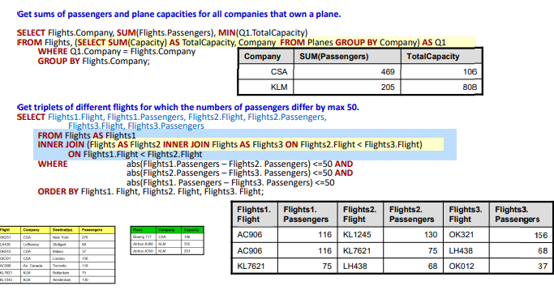
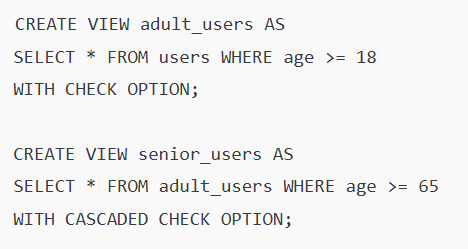
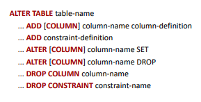

### 4. přednáška 
#### limited number of rows
- problém je, že když chceme třeba top 1 a dvě věci mají stejnou hodnotu a jsou top 1, dostaneme pouze jenom jedno
    - to by se dalo vyřešit jako 'Select Plane from Planes where Capacity =ALL(select Max Capacity from Planes)'
- takže top k je super, dokud víme, že tam bude více hodnot stejné hodnoty 

#### nested otázky
- 
- co to sakra 

#### database views 
- je to  vlastně pojmenovaný SQL dotaz, který se dá interpretovat jako tabulka (která se vytvoří poté, co se dotaz spustí)
- tvorba je dynamická, výsledek se nikam neukládá, databáze opakovaně spouští ten dotaz a spočítá aktuální data
- jednoduché views dovolují upravovat tabulky (musí ale být jednoduché, nesmí obsahovat složité dotazy s join, group by a podobně)
- 'WITH CHECK OPTION' 
    - databáze mi nedovolí tam vložit nový objekt do tabulky, pokud nesplňuje zadané pravidla ve view (když někomu musí být víc než osmnáct, tak se mi tam nepodaří přidat nikoho pod osmnáct)
    - tohle se může dělat jenom pro jeden view (local)
    - nebo se to kontroluje i při view, které z něho vychází (cascaded)
    

#### tvorba tabulek 
##### column-scope integrity constraint
- když vytvářím novou tabulku pomocí CREATE TABLE, tak pro každý sloupec můžu určit, jaká data do něj smí být vložena - integritní omezení 
    - cálem je zachovat konzistenci dat, abych v databázi nemohly vznikat nesmysly 
- NOT NULL - hodnota nesmí být null
- UNIQUE - hodnota musí být užitečná (žádné dva řádky nejsmí mít stejnou hodnotu)
- PRIMARY KEY - unikátní identifikátor řádku (kombinuje NOT NULL a UNIQUE)
- REFERENCES - vytváří cizí klíč, kde ta hodnota už musí existovat v jiné tabulce
- CHECK - libovolná podmínka, co musí být splněna
- constrainy se kontrolují při vkládání a aktualizaci dat, kde pokud chci změnit řádek, tak databáze zkontroluje omezení
    - pokud to projde, provede změnu
    - pokud to neprojde, selže
- 'Available BIT DEFAULT TRUE' - hodnota je boolean a defaultní hodnota je TRUE
- 'Price DECIMAL(6,2) NOT NULL' - cena má šest indexů a dva z toho jsou za desetinnou řádkou
- 'Producet INTEGER REFERENCES Producer(Id)' - cizí klíč, který říká, že Producer musí odpovídat EXISTUJÍCÍMU Producer.Id v tabulce Producer

##### referenční integrita
- když mám dvě tabulky propojené cizím klíčem, tak se databáze postará o to, aby vazba zůstala platná 
- když hrozí porušení cizího klíče, můžou nastat dvě situace   
    - žádná referenční akce není definována a vychozí chování je, že databáze zahlásí chybu a operaci zruší
        - vazba se totiž musí zachovat
    - je definovaná akce a databáze reaguje podle toho, jak jsem to definovala pro DELETE a UPDATE¨
        - CASCADE - provede se stejná akce i v odkazující tabulce (když smažu výrobce, smažu i jeho výrobky)
        - SET NULL - hodnota cizího klíče se nastaví na NULL (výrobek zůstane ale bez výrobce)
        - SED DEFAULT - hodnota cizího klíče se nastaví na DEFAULT (výrobek dostane defaultního výrobce)
        - NO ACTION - akce se neprovede a databáze zahlásí chybu (nelze smazat výrobce, který má produkty)

##### alter table 
- příkaz 'ALTER TABLE' slouží k tomu, aby se změnila struktura existující tabulky, ne její obsah
    - přidá nebo odstraní sloupec, přidá nebo odebere constraint
    
- některé změny nejde provést, pokud naruší existující integritu nebo data
    - pokud chci přidat primary key, ale v datech jsou duplicity
    - změnit typ sloupce, ale některé hodnoty se nedají převést (ze string na float)
    - chci přidat contraint NOT NULL, ale některé záznamy v sobě mají NULL

##### drop table
- odstraní tabulku 
- když chci odstranit jenom část, použiju DELETE FROM 