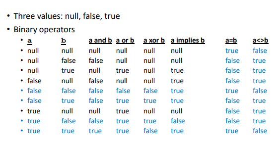
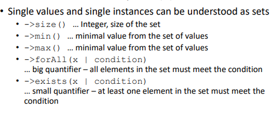
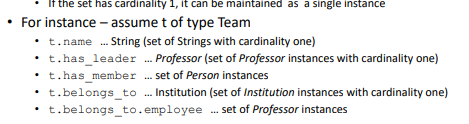
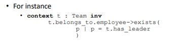
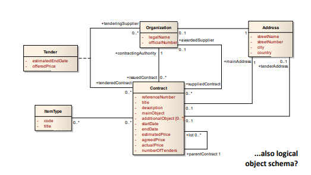
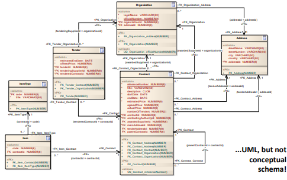
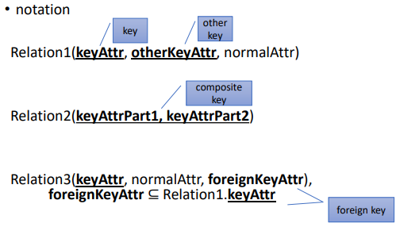
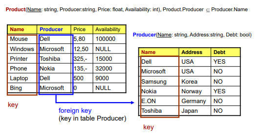
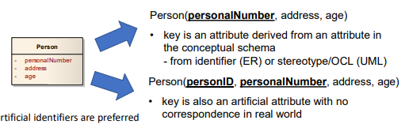
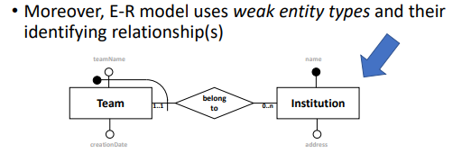

#### přednáška 2
##### pokračování objektové reprezentace 
- jde napsat algoritmus, kterému hodíme konceptuální předpis databáze a on ho vytvoří
    - říct taky, kde to chceme spouštět

##### object constraint language (ocl)
- jazyk pro formální specifikaci pokročilých integrity constraints
- používá invarianty, které musí platit
    - chci, aby se v databázi nacházely jenom projekty, které jsou mladší než 1990
        - tohle se v uml nekontroluje, tam se jenom píše, co si o daném objektu budeme pamatovat (ale nejsou tam žádná omezení, které se tam mají ukládat)
    - jde přidat podmínka, která řekne 'já chci, aby každý tým o více než 10 členech, pracoval na nějakém projektu'
        - ta databáze musí kontrolovat data a zajistili, aby se tam takovéto týmy nedaly přidávat 
        - neřešíme, jak se to má kontrolovat, ale pouze, že se to má kontrolovat

##### info o ocl 
- je tady boolean logika (i jako implikace a podobně)

- invarianty mohou být dost složité
- jsou tu i set operátory pro to, abych z toho vydobila informace

- je tu hrozně divná konvence zapisování, kdy se tu používá šipka
- když chci vydobít info o tom objektu

- celková ukázka předpisu

##### logická layer of databáze
- v tomhle kroku jde o to, jaký logický datový struktury (které jsou počítačově srozumitelný) budou použitý
    - budu data ukládat do tabulek, xml stromu nebo grafových věcech 
- pořád nás nezajímá, kde budou tabulky uložené (microsoft, oracle a bla bla serveru)
- rozhodneme pouze, že ta data budou relační, ale nerozhodneme, který relační program využijeme
- už je dělaný na to, aby 

- pokud ty data mám uložený, abych si je vyměňovala s jinýma subjektama nebo je vyžadoval od svých klientů nebo to posílal na úřad, tak se v téhle úrovni řekne, v jaké struktuře se to má posílat
    - pevně dané, aby se to poté dalo automaticky zpracovávat 
        - když třeba klient bude dodávat objednávky, tak budou v uniformním předpisu
    - na tohle se hodí xml

- když jsou data vystavena na webu, tak se použije zase jiná struktura

##### problém 1 a 2
- když budou data primárně používaný pro jeden účel, tak ta logická struktura by měla být vybrána specificky pro tenhle účel
- nebo je potřeba více modelů, pokud se data budou používat ve více účelech
    - kus dat se bude ukládat do grafů, část do xml, část do relačních tabulek
    - tyhle data nejsou navzájem disjunktní, může se stát, že se ty data uloží třikrát jinak
    - je potřeba zajistit, aby ta data byla všude stejná 

- problém 1 je, který model si vyberu
- problém 2 (horší) je, které modely si vyberu pro kterou činnost a jaká data tam uložím

- když přijde zákazník, že je potřeba něco změnit, tak já to změním na té konceptuální úrovni a ty věci pod tím se změní automaticky
- když udělám první konceptuální popis a vyberu ty struktury, tak je to ještě jednoduché
    - když ale po několika letech přijde požadavek na změnu kardinality, přidám mezitřídu, tak je potřeba tu databázi změnit a ne vymazat
    - pro tenhle účel má uml možnost modelovat na více úrovních

##### practical example 1
- databáze pro český e-goverment, který si potřebuje ukládat info o veřejných zakázkách (kdo to bude řešit, od koho, kdy zadáno) a musí to být na webu přístupně
- konceptuální model zde: 
- tohle se dá v uml předělat na relační model, kde budu mít sloupečky, kde bude řečeno na co odkazují, co je primární klíč 
    - dostanu ten model už s informacemi o klíčích (co je primární klíč)

- přepracovat to na databázi už je algoritmické, pokud mám dobrý konceptuální náčrt

##### object vs. relational model
- objektový model je super pro data uložená jako objekty (in terms of OOP)
- existuje knihovna, co to spojuje, kde vrchol je objektový návrh a spodek je relační, abych se nemusela zajíamt o moji hierarchii persistency

- když si vyberu ten relační, pokud je konceptuální předpis už objektový, tak tu existuje object-relational mapping
- většina relačních databázích dnes, tak už jsou objektově-relační (univerzální), které umí pracovat s objetky, polymorfismem, děděním 

- když se objevily objektové databáze, tak se předpovídalo, že relační umřou, ale oni se naučili objekty, pak vznikl xml styl a relační databáze se naučily pracovat i s tímhle 
    - relační databáze umí spoustu věcí (i obrázky, zvuky - multimédia všeho druhu), aby přežily 

- my se budeme zabývat relačním modelem bez těch všech věciček okolo (prostě čisté relační databáze)

##### relational (relační) model
- potřebuju přeložit všechno to, co jsem popsal jako objekty a entity, tak je potřeba to přeložit do řeči těch tabulek
- mám základní integritu, že si můžu definovat primární a cizí klíče (jak se jmenují dané sloupečky)
- potřebuji tabulkové vztahy s jejich atributy na tabulky se sloupečkami, protože nic jiného nemám 
- všechno musí mít spešl jméno 

- z teoretického hlediska je zakázáno, aby v jedné tabulce byly dva stejné řádky
    - v praxi se tam přidá další sloupec s row idea
- ve sloupečcích by neměly být prázdná místa, ale když to chci, hodím tam null
- každá množina sloupců, které definují řádek, se nazývá *superkey*, a pokud je minimální co do inkluze, tak dostanu klíč té relace
    - může být víc těch klíčů 
    - každá minimální sada sloupců, které mi identifikují daný řádek, tak to je ten klíč té relace 
        - když je to pět sloupců, tak pokud znám víc jak pět hodnot, tak už je to klíč (je ale jedno v jakém pořadí a jestli jsou na stejných indexech)

##### notace 

- když tam jsou dva sloupečky, které jsou podtržené (rozdělené) a boldem, tak to jsou dva různé klíče
- když to bude spojené podtržení, tak dělají jeden dlouhý klíč
- foreign key je boldem a nepodtržený 

- máme tabulku, která popisují výrobce (producer) a výrobky (produkt)

- u producer.Name nesmí být dvě stejné hodnoty 
- u produktu se nachází výrobce, tak je to foreign klíč, takže to mohou být pouze hodnoty z té tabulky producer (nesmím tam dodat teslu jako producer, když není v té původní tabulce)
    - může tam ale být dvakrát stejný název (viz. microsoft)

##### preložení konceptuálního schématu
- potřebuju celý svět převyprávět do řeči tabulek a sloupečků a (cizích) klíčů
- chci, aby ten překlad byl algoritmický a determnistický 
    - mám recept, jak to přepsat, a model, to sprcnu a dostanu cíl 

##### translation of classes
- první požadavek: každý cizí klíč nesmí být *null*
    - pokud tohle omezení uvolním, tak se dostanou možné nápady, jak se to vyřeší
- druhý požadavek: co nejméně tabulek
    - čím méně, tím méně režie
    - když chci přeložit typ nebo třídu, tak z toho udělám stejnojmennou tabulku
    
        - je možnost tam přiřadit umělý klíč (druhý případ), o který se mi bude starat ta databáze (entita o tomhle čísle neví a neumí ho používat), ale je to další klíč 
            - jde dělat obojí 
        - je tu problém, že tam bude vícenásobná kardinalita, což si nesmíme dovolit v tabulce, kde v jednom čtverečku musí být jedno číslo, i když těch telefonních čísel může  být víc
            - řeší se to tak, že uděláme pro tenhle atribut novou tabulku, kam ta čísla uložím 
            - pokud budou atributy složené (to jde v er, třeba adresa, která má číslo popisné, ulici a město), tak se to musí poskládat hierachicky, kde každý sloupec bude 'adresa-město', 'adresa-čsp', 'adresa-ulice'

- překládání vztahů
    - mám dvě entity (dvě tabulky) a potřebuju si pamatovat, které dvojice k sobě patří 
    - udělám si novou tabulku, která si bude pamatovat, co k čemu patří (telefonní čísla - osoba)
        - narvu do tabulky dva cizí klíče, kde jeden odkazuje na osobu a druhý na telefonní číslo 
    - potřebuju ještě říct, jak budu identifikovat řádky v tabulce
        - to je podle toho, jaká je kardinalita
        - když chci, aby každá osoba měla jeden mobil, tak osobu označím jako klíč, aby tam nemohla být dvakrát (osoba může mít nanejvýš jeden mobil), to samé jde udělat pro telefonní číslo (to číslo má nanejvýš jedna osoba) - udělám z obojího nezávislé klíče

    - další případ: každá osoba musí mít vlastní mobil, ale ne každý mobil musí mít zaměstatnce (když třeba leží v šuplíku a čeká)
        - mám tři tabulky - osoba, vlastnění a mobil 
        - když přidám osobu, tak musím dodat řádku do vlastnění (když tu osobu vyhodím, tak z té tabulky vlastnění musí tak vyletět)
            - v těch dvou tabulkách musím synchronizovat počet řádků a personID - moc práce, slepím ty dvě tabulky do jedné
                - vazební tabulku vnořím do těch osob, protože mají povinnost mít ten mobil (ten telefon se dá přidat jako cizí klíč rovnou pro člověka)

    - další případ: každý mobil musí mít jednu osobu a jedna osoba má jeden telefon, tak to prostě všechno vrazím do jední tabulky místo tří 
        - když zaměstance vyhodím, tak musím zahodit jak tu osobu, tak i ten telefon 
        - když ho ztratí, tak ho musím buď vyhodit anebo mu koupit telefon 
    
    - další případ: jedna osoba má víc telefonů, ale telefon má max jednu osobu 
        - ve vazební tabulce nemůžu dovolit jeden mobil vlastněný dvěma lidmi - mobilID bude klíč 
        - na druhou stranu, osoba klíčem nebude, protože tam může být víckrát
        - když telefon má mít jednoho vlastníka, tak vlastníka hodím do tabulky pro Mobile jako cizí klíč 
    
    - další případ: víc čísel pro osobu, víc osob pro číslo
        - třetí tabulka, kde ty klíče musí být symetrické, tak z těch dvou klíčů uděláme jeden společný klíč
            - číslo a osoba se může opakovat, ale dvojce jako taková se opakovat nemůže 

##### hierarchie do tabulek 
- co třída, to osoba (třída student, tak tabulka student)
    - když dědí nějaké hodnoty, tak ponechat stejný název hodnoty (místo studentID, tak personID) a dát to jako cizí klíč 
    - pro: je to flexibilní (když něco přidám, tak se to automaticky dodá do tabulek)
    - proti: když je to dost hluboká třída, tak se musí pojoinovat několik tabulek dohromady, a to žere čas

- celou hierarchii narvu do jedné tabulky
    - pro: vyhnu se joinům
    - proti: datum nástupu pro studium je povinné pro studenta, ale ne pro profesora
        - takže u studenta tu hodnota musí být a teď, co dát k profesorovi, když tam nesmí být null 
    - proti: když osoba vystupuje ve více rolích, je těžké tam tu osobu narvat do více řádků

- když hlavní třída je abstraktní, tak každý potomek bude jedna třída
    - proti: když chci všechny osoby, musím projít dvě tabulky, jak pro studenty, tak pro profesory (žere to čas)

##### er problémy
- když tam mám slabou entitní typy, tak když tam překládám tým a musím tam dodat identifikátor instituce a klíčem pro tenhle objekt bude ta dvojice 

- je potřeba tam zabránit duplicitám 