#### 1. přednáška 

##### info o předmětu 
- zápočtový test na konci listopadu 
    - znalost z první půlky předmětu
    - dva vouchery na dvě poloviny
    - potřeba alespoň 60 % bodů 
- zkouška spíše teoretická 
    - spíše z druhé půlky předmětu, ale bude tam i první půlka
    - tady taky 60 % bodů na trojku
    - na stránkách ukázky zkoušky, nejlepší jsou ty nejnovější, ty starší obsahují látku, kterou nebudeme brát 
- cvika a přednášky dobrobovolná, ale cvika highly doporučená
- obsah kurzu:
    - základ datovýho modelování 
        - model a transformace na logický model (jak získat sadu tabulek, která obsahují data, která chceme)
        - převod do fyzické verze (pomocí sql)
        - dotazování (rozumná odpověď na rozumný problém)
    - po zápočtu teoretické věci
        - zda relační model je dostatečně rozumný nebo se s tím musí ještě něco udělat 
            - neefektivní uložení dat 
        - transakční zpracování dat
            - když k databázi přistoupí víc lidí najednou a jak zabránit chaosu 
    - závěrečné přednášky
        - moderní databáze, které v sobě nemají uložené tabulky, ale něco jiního

##### database managment system 
- sada souborů, kde je řečený, jak se ukládá jméno, datum narození (prostě aby to bylo jednoduše nalezitelný)
- softwarová nástavba, aby se k tomu uživatelé dostali a zároveň aby byla data hlídaná ve všech možných pohledů
    - musí se to nějak ukládat, je k tomu potřeba nějaké kusy kódu na změnu záznamu, přidání a odebrání anebo nalezení 
    - když dva vytvoří telefonní databázi, tak navzájem nebudou chápat, co bude dělat ten druhý 
    - prostě jsou tam serepetičky, co by se musely řešit znovu a znovu, když by se přímo přistupovalo k datům, a tak vytvoříme schránku - *database managment system*
    - software je právě pro to, aby se tomuhle zabránilo
        - rozbití dat, kdo má k čemu přístup a bla bla bla 
    - na tohle je potřeba administrátor, který definuje nové uživatele a jaké mají práva 
        - nebo zálohování dat nebo obnovení dat ze záloh

##### basic terminology 
- představa zákazníka a to, co se reálně stvoří, je velká propast
    - nejdříve je potřeba sjednotit názvosloví, aby se pochopilo, co ten zákazník chce 
    - tak aby to pochopil ten zákazník, ne my (jednoduché pojmy)
    - poskytnutí světa od zákazníka v přirozeném jazyku, kde pojmy nejsou jednozačné a my si nejsme jisti, co se po nás chce 
- jaký data potřebuje na vstupu, na výstupu, uvnitř a je to potřeba natolik formálně, aby to bylo jednozačné a šlo z toho udělat ta databáze
- na to jsou jazyky, které tuhle propast překlenou 
    - popis, který bude jednoznačný, ale zároveň to pochopí ten zákazník 
    - vizualizace dat pro zákazníka (obrázkové diagramy)
        - co znamená, která část toho obrázku a zákazník tak pochopí, zda jsme ho pochopili nebo ne a co chce změnit 
        - *stakeholders* - lidi, co mají co říct k tvorbě té databáze 
- chceme, aby ty modely fungovaly na různých verzích abstrakce 
    - *conceptual layer* - nezávislá na tom, jaký typ databáze si vybereme; nejblíže k přirozeného jazyka
        - zjistit jaký data potřebuju do té databáze ukládat 
    - *logical layer* - jaký typ databáze si vyberu a jak se data budou ukládat 
        - grafová databáze a podobně
    - *physical model* - sada souborů a formátů, kde jsou ta data uložená
        - o to se postará ta databáze sama 

##### konceptuální úroveň
- musí být dalšími kroky chápaná jednoznačně, ale zároveň pochopitelné pro vnějšek
- data driven model 
    - jaká data tam chci, jak mají vypadat a jak s nimi budu pracovat, aniž bych řešil na jakém operačním systému to poběží
- když chci ta data modelovat, tak potřebuju od zákazníka získat tři sady věcí
    - které všechny typy objekt, o nichž si musí něco pamatovat 
        - škodovka - výrobní linky ve výrobních halách, u nichž jsou zaměstnanci
            - musí se pamatovat zaměstnanci, objednávky, výrobní linky 
    - o každém typu objektu si pamatuju jinou sadu věcí (info o zaměstanci x info o autu)
    - vztahy mezi těmi objekty 
        - linky stojí v nějaké budově a na těch linkách stojí stroje (který stroj stojí na které lince)
            - který člověk má školení na to, aby mohl pracovat s kterým strojem 
    - sadu informací o každém objektu  

- model nezávislý na konkrétním typu databáze, ale zodpoví, co si databáze musí pamatovat za objekty a jaké jsou mezi nimi vztahy 
- pořád pracuje s termíny od toho zákazníka, takže se to dá debatovat se zákazníkem, jestli tohle pochopení je už správné
    - 'já pochopil, že je potřeba započítat, že někteří zaměstatnci dostávají více výplat měsíčně' 'to je blbě' 'okej, dík'
    - probrat to s více lidmi, kteří mají povědomí o nějaké části, ale o jiné zase ne 
- na začátku je zákazník    
    - jsme univerzita, máme vědce a chceme sociální síť, co nám bude združovat výzkumníky - kontaktovat se navzájem, seznam týmů, co dělají 
        - který tým oslovuje které firmy (astrofyzikové jsou osloveni big data týmem)
- projdu text a najdu entitní typy, které budou naším základem (lidi, projekty, typy profesorů a výzkumínků, různé skupiny a katedry)
- pak zaměstnavatel řekne, že nás nezajímá různé druhy výzkumníků, takže zkrouhneme čtyři typy výzkumníku na jeden
    - nebo že chce rozdělit lidi na studenti, výzkumníky a učitele

- vztahy mezi entitami 
    - vztahy jsou binární (dva konce vztahu), více-nární (když v tom vztahu je více entit)
    - student si zapisuje přednášky - kolik si může zapsat přednášek (právě jednu, nejméně jednu, kolik chce)
        - kolik lidí si může zapsat danou přednášku 
    - osoba může mít jiné osoby coby kolegy 
        - když dostanu dva lidi, tak musím zjistit, zda jsou kolegové nebo ne 
        - nebo zda je osoba členem daného týmu nebo ne 
        - nebo zda dvojice týmů může spolupracovat
    - kardinalita vztahů 
        - může tým pracovat s více týmy nebo jedním týmem 
    - vztah, který dává dohromady víc věcí 

- co si potřebuju pamatovat o jednotlivých instatncích entit 
    - každá osoba musí mít u sebe jméno a telefonní číslo (musím být schopný pamatovat i více čísel), id a email
    - pamatovat si, kdy se osoba stala součástí týmu a kdy to členství ukončila 
        - tohle není info o té osobě, protože mohla dělat ve více týmech (nebudeme vědět, v jakém to bylo týmu)
        - zároveň se to nedá přiřadit jako info k tomu týmu (někdo tam pracoval dva měsíce, ale kdo?)
        - je potřeba si tohle info pamatovat u toho vztahu, co tam je (osoba + tým)

##### jazyky pro úrovně abstrakce
- na každé úrovni abstrakce jsou na tom různé jazyky  
    - uml class diagram (zkráceně uml) a poté entity-relationship model (zkráceně er)
        - každý z těch jazyků má své výhody
        - na přednášce se budou řešit tyhle dva 
    - pro každý z těchto jazyků potřebujeme ty tři skupiny, jen se to v každém jazyku jmenuje jinak
        - uml: classes, vztahy a atributy
            - má standart na diagramy, takže když uděláme diagram a ukážeme ho jinému informatikovi, tak by měl pochopit, co se tam děje
        - er: entity types, relationship types a atributy
            - er to tak nemá, spoustu podvariant 
                - různé týmy budou používat trochu jinou notaci a když změníme skupinu, bude se možná potřeba doučit, jak ty diagramy vypadají

##### jak se v diagramech zaznamenávají věci
- er
    - chlíveček pro osoby, chlíveček pro tým a bla bla bla - potřebuju si 
    pamatovat informace o týmech, lidech, ale ne, které informace to jsou
    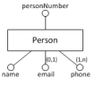
- uml 
    - tam už jsi pamatujeme, které info je potřeba si pamatovat 
        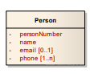
- diagram by měl být souvislý graf, co se nerozpadá (když to tak není a někde v rohu plave entita, co není se zbytkem propojena, tak je to divný a je to potřeba dořešit)
    - er model má kosočtverce, kam je napsán typ vztahu 
        - je tam potřeba zavést kardinalitu - v kolik týmech ta osoba může být (0 až n)
    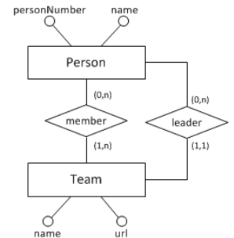
    - uml model má čáru, co si pojmenuju (sémantika)
        - kardinalita je tady obráceně, než v tom er modelu (jsou tu prohozené)
            - is member je u týmu, ne u osoby
            - + něco je label, který nám něco říká o tom vztahu
                - jeden otec může mít až n synů, ale syn má právě jednoho otce
                - když tam ten label nedáme, tak nemusí být jasné, jak ten vztah funguje 
            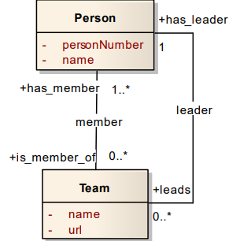
    - dodatečné info o vztazích
        - v er kolečko připojíme na kosočtverec
        - v uml si uděláme pomocnou třídu a tam si pamatuju všechno potřebné 

- uml vzniklo pro objektový návrh - potřeba existence podtřídy a nadtřídy 
    - student je spešl případ osoby (zdědí všechno od předka a dodá se k tomu, od kdy studuje)
    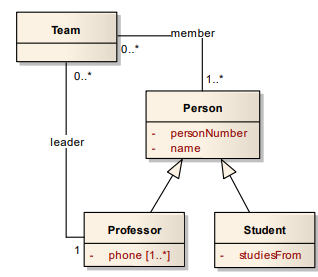
    - jelikož je to užitečné, bylo to dodáno i do er modelu 
        - IS-A vztah se tomu říká
        - vypadá to úplně stejně jako v uml 
        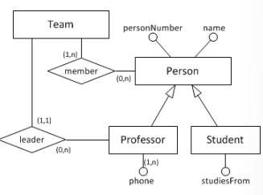

- hierarchie tříd 
    - je potřeba zodpovědět dvě otázky - covering a overlap constraint
        - jestli je třída abstraktní (jestli jsou všichni studenti nebo učitelé a teda nikdo sám o sobě není osoba) - *covering constraint*
        - může existovat instance, která je profesor a student zároveň (pokud ne, tak je exkluzivní, ale v datech to jde naprogramovat tak, že to může být obojí - viz doktorand) - *overlap constraint*
 
- rekuzivní asociace 
- více-arní vztah
    - spojuje více věcí než jen dvě 
        - pamatuju si, v jakém týmu pracuje jaká osoba na jakém projektu
        - zas je tam potřeba dodat kardinalitu
        - v obou jazycích to vypadá stejně 
        - v uml se může stát, že osoba pracuje na projektu, ale ne v týmu, a tak kardinalita u týmu bude nula  
        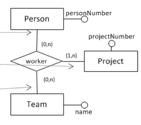
    - n-ární vztah se nedá nahradit více binárními vztahy, vymizí nám tam nějaké vztahy 
        - jsou tam oddělené informace, v jakém týmu je a v jakém projektu je a už se nedá dohromady, v jakém týmu dělá na jakém projektu

    - můžeme z toho vztahu udělat vlastní instanci, která bude propojená s jinými isntancemi 
        - ale zase to nebude ekvivalentní 
        - nový popis je bohatší a dovolí nám si pamatovat víc věcí 
        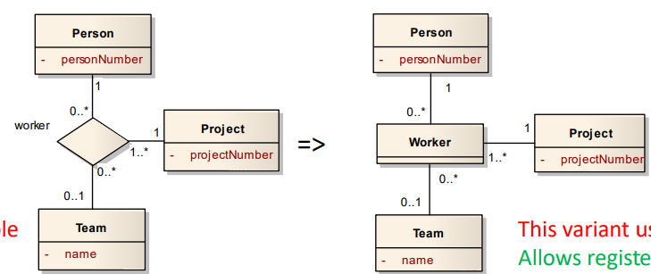
        - ve vztahu si nepamatuju si nedokážu zapamtovat, že tam ta osoba byla dvakrát ve vztahu s týmem
            - když se ten vztah už udělá a osoba přijde znovu, že se chce spojit, tak už není kam si uložit, kdy osoba znovu začala pracovat v týmu 
        
##### identifiers v er 
- když mám id číslo osoby, tak už si jednoduše spojím, o kterou osobu jde, protože každá má vlastní číslo 
- dvojice a vícetice mohou taky tvořit klíče 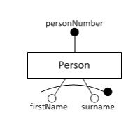

##### weak entity types v er 
- v reálném světě si každá instituce může zajistit, aby se každý tým jmenuje jinak, ale když se více institucí dá dohromady, tak tam může být stejný název týmu v různých institucích 
    - do identifikátoru zahrnu i vztah, do jaké insitutce patří 
    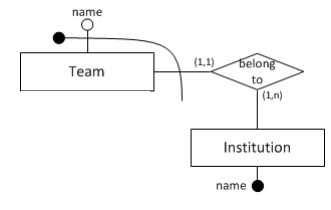
- nepříjemná vlastnost je to, že se ty identifikátory mohou řetězit 
    - univerzita -> fakulta informatiky -> katedra čeho chceme
        - a pak ten identifikátor se prodlužuje, protože nejde říct katedra fakulty nějaké univerzity 

##### data types
- přidat typ, jestli je to číslo nebo řetězec nebo datum
- typicky nejpozději, když z toho chceme už tu fyzickou verzi, protože ta databáze to musí vědět (aby v tom uměla hledat a řeadit to)

##### kompletní example v uml 
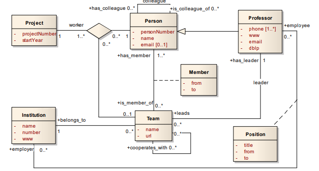
- když tenhle obrázek dám dvěma různým týmům, tak by jim měla vypadnout stejná databáze 
    - nejvíc intelektuální práce se provede tady v konceptuální verzi
        - neustále iterovat se zadavatelem, zda to dobře chápeme
