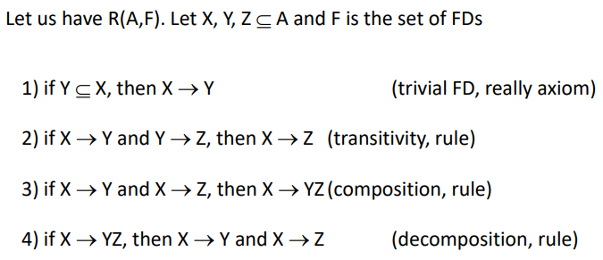
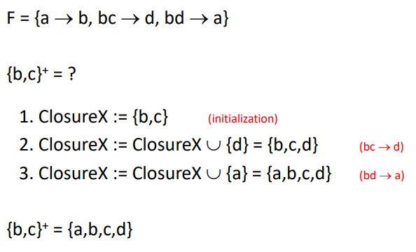
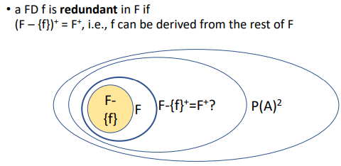
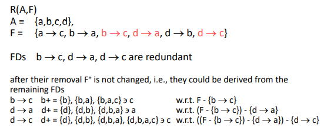
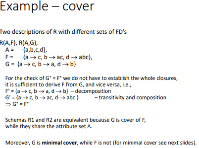
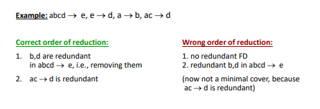

### 6. přednáška
#### funkcionální dependencies
- hodnoty určitých atributů jednoznačně určují hodnoty jiných atributů
- nevyplývají automaticky ze systému, ale navrhují se při návrhu databáze

- když nám někdo řekne sadu těch závislostí, tak nám nevyjmenuje všechny, protože když platí nějaké závislosti, tak platí i jiné (a tyhle podmínky nám nikdo neřekl)
- chceme aparát, který nám bude říkat, co musí platit (je to podobné logice)
- pro každou relaci potřebuju získat sadu závislostí, s nimiž budu poté pracovat (tohle nevykoukám z toho, že se podívám na databázi, jaké mají řádky)
- když X určuje Y a Y určuje X, tak obsahují stejnou informaci a jsou si funkcionálně ekvivalentní 

- když koukám do tabulek, tak mi z nich něco vyplyne, ale to nemusí být pravda pro všechny (bude to pravda jenom pro tu jednu tabulku, na kterou teď koukám), takže koukáním do tabulky najdu spoustu příkladů, které by měly být podle oka propojené, ale v realitě nejsou

#### armstrong's axioms
- máme sadu závislostí a my z nich budeme vyvozovat jiné závislosti 
- pro tohle jsou amstrongovy axiomy (reálně jenom jeden z nich je axiom)
    
- tyhle závislosti jsou triviální a platí v každém případě
- to, co se dá odvodit z těch pravidel je pravdivé, a to, co se nedá odvodit, je nepravdivé

#### atribute closure
- když se dvě instance shodují v barvě a tvaru, tak se musí shodovat ještě v něčem (když se shodují ve tvaru, tak se podle pravidel budou shodovat v počtu vrcholů)
- nicméně odvozovat to pomocí těch armstrongových pravidel je náročné, protože se tam musí dokazovat, že to platí
- existuje na to algoritmus, který nám řekne, co platí, když platí nějaké pravidla 
- na vstupu máme F (ty pravidla) a podmnožinu atributů, v němž se ty instance se shodují a na výstupu budeme mít množinu atributů, v nichž se určitě shodují
    - do toho výstupu budou patřit i ty atributy, které byly zadány ve vstupu (když bylo řečeno, že se shodují v barvě a tvaru, tak se shodují v barvě a tvaru)
    
- v kroku 3 jsme nemohli použít první závislost, protože 'a' není v podmnožině ClosureX a tu druhou také ne, protože obě strany už jsou podmnožinou ClosureX

#### closure of set of FDs
- tohle je vygenerování funkčních závislostí z funkčních závislostí 
- neplést s atribute closure 
- closure of set má až exponenciální velikosti, ale atribute closure bude jenom n, kde n je # atributů
- existuje na to algoritmus - IsDependencyInClosure
    - spočítám $X^+$, a pokud se v té množině nachází to $Y$, tak víme, že $X \to X^+ \to Y$ a využijeme tranzitivitu

#### redundant dependency in set of FDs
- zjistit, jestli tahle závislost v tom F není zbytečná 
    
- jak to zjistit?
    - vyhodím tu jednu závislost, a pokud jsem schopna z těch ostatních ji odvodit, tak je tam redundantní 
    - jak to odvodit? převedu na problém atributového uzávěru
- problém v algoritmu je to, že podle toho, jak jsou ty atributy seřazeny, tak se mi nechá počet atributů (při jednom seřazení mi tam zbyde jenom jeden atribut, ale při jiném tři)
    
- příklad: 
    
    - je redundantní $a \to c$? není, v ostatních závislostech se na levé straně nenachází $a$
    - je redundantní $b \to c$? ne 
    - jakmile je nějaká z nich odvoditelná, tak ji vyhodím a až půjdu na další, tak už budu používat tu množinu bez té redundatní závislosti 
    - zase, jde tu o pořadí - to určuje, které jsou redundantní 

#### cover
- cover množiny F je jakýkoliv set G, kde se shodují jejich uzávěry atributů ($F^+=G^+$)
- kanonické pokrytí 
    - v sadě závislostí mají všechny na pravé straně právě jeden atribut
- non-redundant cover
    - nemůžeme vyhodit žádnou závislosti
    - co nejúspornější popis tohoto světa
    - z $F$ vyhazuju tak dlouho, dokud to jde
- příklad:
    
    - jak poznat, jestli platí cover? zkontroluju, jestli jsou všechny z $F$ odvoditelné z $G$ a vice versa 
        - pokud ano, tak je to cover

#### minimal cover
- co nejmenší pokrytí, které v sobě nemá nic navíc
- tři kroky:
    
    - rozepsat pravidla, aby napravo byl jenom jeden atribut
    - odstranit ze závislostí s větším počtem atributů nalevo co nejvíc reduntantních atributů 
        - v $abcd \to e$ je redundatní $bd$, protože platí, že $a \to b$ a $ac \to d$
    - potom projedu všechny pravidla a odstraňuju ty, co jsou redundatní $ac \to d$, protože víme, že $ac \to e$ a $e \to d$
    