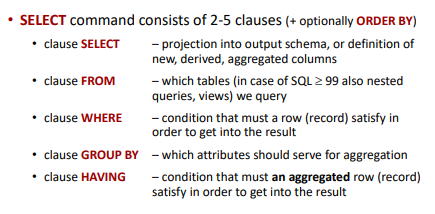
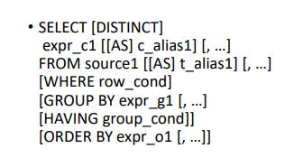
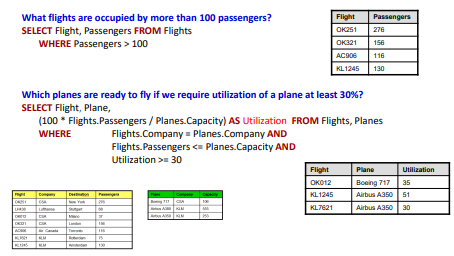
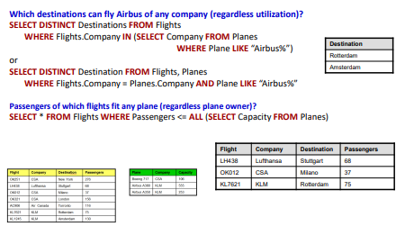

### přednáška 3
#### sql dotazy
- skládají se z šesti klauzují 
    
- order by je šestý a optional
- autoři se snažili, aby ty příkazy byly dost podobné anglické větě 
- sémanticky se začíná od *FROM* a dál a *SELECT* se vyhodnocuje až na konec
- from má v sobě čárkou oddělené tabulky a vybere ty potřebné řádky a poslepuje je za sebou (kartézský součin)
    - všechny ty skupinky, co vzniknou, tak projdou do *where*, a pokud splní ty podmínky, tak se to pošle do group by (pokud jsme ho tam nechali)
- můžeme tam dodat *distinct*, který nám zaručí, aby se nám neopakovaly dvojice (když tam narazíme znovu na něco, co už jsme do výsledku dali, tak to vyhodíme)

- otestovat, že je něco null se dělá pouze pomocí *plat is null*
- negace se dá vrazit před podmínku anebo do podmínky, a je to to samé
    - *plat between 50_000 and 100_000*
        - *not plat between 50_000 and 100_000*
        - *plat not between 50_000 and 100_000*
- *jmeno like 'kop%'*
- když se chci vyhnout *den = 'Po or den ='Út' or den= 'Pá'*, použiju *den in ('Po', 'Út', 'Po')*
    - můžu tam dosadit *den in (select)*, ale pouze pokud to vrátí jednosloupcovou odpověď  
        - jinak to nebude fungovat
- příkaz *exists* (dělá to přesně to, co si myslíme)
- *výraz ><= all/any(select...)*
    - aby ten výraz byl pravdivý pro all, tak to musí platit pro všechny 
    - pro any je to nejméně pro jeden
    - select tu zas je jednosloupcový
- *<>* tu funguje jako *!=*
- *where plat >= all(select plat from Zamestnanec)*

#### další funkce
- select count(company) from Flights - spočítá počet firem
    - count(\*) - spočítá počet řádků, ale nijak je nekontroluje, vezme i řádky, které jsou *null*
- min
- max 
- avg (average)
- sum 

#### příklady where klausule

- Flights.Company = Planes.Company - letadlo je vlastněné tou samou společností, co provozuje ten let, na které má být to letadlo použito
- pokud chci složitější where dotazy, použiju *in*, *exists* a podobně

- ta první otázka řeší, jestli ty letadla jsou vlastněny někým, kdo má ve jméně 'Airbus' - *WHERE Plane LIKE "Airbus%"*
- dotaz se dá napsat více způsoby 
- ta poslední otázka hledá lety, kde počet cestujících je tak malý, že by mohli být přepraveny všemi možnými letadly

#### joins 
- 