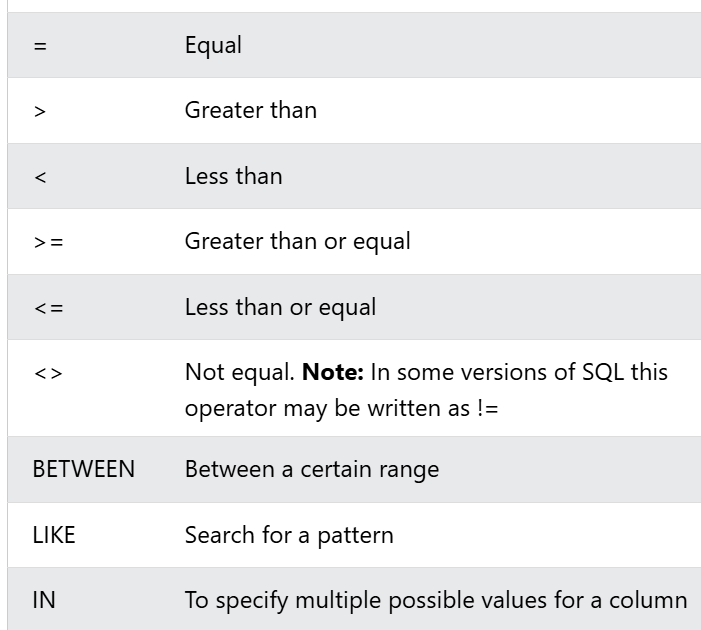
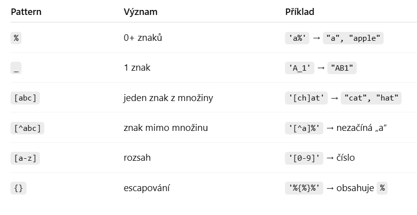
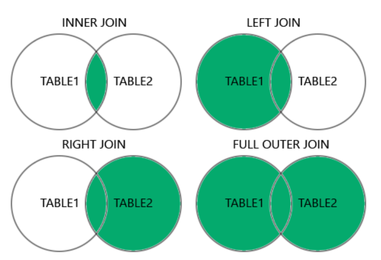
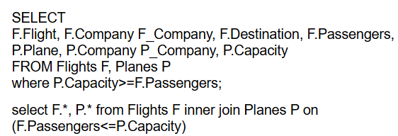
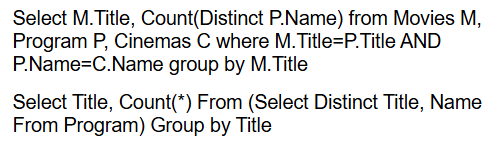

### základní pojmy
#### SELECT
- vytahuje info z databáze
- syntax: SELECT column1,column2,... FROM table_tanem
- select all columns: **SELECT** * FROM Costumers

#### DISTINCT
- vrací pouze různé hodnoty 
- syntax: SELECT **DISTINCT** Country FROM...

#### WHERE
- filtruje records, aby se vrátilo jenom to splňující podmínku
- SELECT * FROM Customers **WHERE** CustomerID > 80
- operátory 
    
    - BETWEEN
        - SELECT * FROM Products WHERE Price BETWEEN 50 AND 60
        - může to dělat i alfabeticky (nejen s čísly)
            - *WHERE ProductName NOT BETWEEN 'Carnarvon Tigers' AND 'Mozzarella di Giovanni'*
        - a na datumy 
            - *WHERE OrderDate BETWEEN '1996-07-01' AND '1996-07-31'*
            - *WHERE OrderDate BETWEEN #07/01/1996# AND #07/31/1996#*
    - LIKE 
        - porovnání textových řetězců podle vzoru (patternu)
        - *%* - libovolně dlouhý vzorec (i prázdný)
            - když tam nebude tak *LIKE 'a'* je pouze to *a*, nic navíc
        - *_* - přesně jeden libovolný znak (jedno *_*, jeden znak)
        - *[]* - jeden znak z množiny
            - *WHERE letter LIKE '[abc]'*
            - *WHERE word LIKE '[ch]at'*
        - *^* - negace hranatých závorek 
            - vybere slova **ne**začínající samohláskami - *WHERE name LIKE '[^aeiou]%'*
        - *-* - rozsah znaků 
            - *WHERE char LIKE '[a-z]'*
            
        - příklady: 
            - *druhé písmeno je "a"* - WHERE word LIKE '_a%'
            - *text začíná na "b" a končí na "s"* - WHERE CustomerName LIKE 'b%s';
            - *text končí na ".com"* - WHERE domain LIKE '%.com'
            - *text začíná na "A* - WHERE name LIKE 'A%'
            - *text obsahuje "cat"* - WHERE content LIKE '%cat%'
    - IN
        - testuje, zda hodnota patří do nějaké množiny hodnot
        - vrátí TRUE? pokud se hodnota nachází v seznamu hodnot nebo v poddotazu
        - příklady: 
            - SELECT * FROM users WHERE country IN ('Czech Republic', 'Slovakia', 'Poland');
            - WHERE age **NOT IN** (18, 21, 25);
            - poddotaz *vrátí zákazníky, co mají objednávku >1000* SELECT name FROM customers WHERE id IN (SELECT customer_id FROM orders WHERE amount > 1000)

#### ORDER BY
- sortne tu výslednou množinu v ascending nebo descending pořadí
- DESC - SELECT * FROM Products ORDER BY Price DESC
    - sortne produkty od nejvyšší do nejnižší hodnoty
    - můžeme to udělat i pro alfabetické seřazení (od z do a)
- víc sloupců - *SELECT * FROM Customers ORDER BY Country, CustomerName*
    - nejdřív to bude sornuto podle Country, a pokud jedna Country bude víckrát, sortne se to podle CostumerName
    - může se tu použít ASC a DESC
        - SELECT * FROM Customers ORDER BY Country ASC, CustomerName DESC

#### logické operátory
- **AND** (konjukce) - aby to bylo TRUE, musí být **všechno** TRUE
- **OR** (disjunkce) - aby to bylo TRUE, musí být **něco** TRUE
- pokud chceme kombinovat, musí to do závorek
- SELECT * FROM Customers WHERE Country = 'Spain' AND (CustomerName LIKE 'G%' OR CustomerName LIKE 'R%')
- **NOT** - vrací ten opačný result
    - NOT LIKE - vrátí to, co není podobné tomu regexu

#### NULL hodnota
- testování, jestli to není/je NULL - **IS (NOT) NULL**
- příklady:
    - SELECT column_names FROM table_name WHERE column_name IS NULL
- pokud chci bez obav porovnávat (aniž bych musela řešit null), tak **=**; když chci řešit i null, tak **is**  
    - **<> tohle je opakem =**

#### FETCH FIRST
- hodí prvních několik (číslo určuje kolik) výsledků 
- příklad: *ORDER BY Price ASC FETCH FIRST 1 ROW ONLY*

#### agregrační funkce
- provedou výpočet na setu hodnot a vrátí jedno číslo
- *MIN()* 
    - SELECT MIN(Price) FROM Products;
- *MAX()* 
    - SELECT MAX(Price) FROM Products;
- *COUNT()* - vrací **počet** hodnot
    - SELECT COUNT(ProductID) FROM Products WHERE Price > 20
- *SUM()* - vrací **součet**
- *AVG()*
- ignorují null hodnoty (krom count)

#### GROUP BY
- spojuje řádky, které mají stejné hodnoty 
- často se to používá pro agregační funkce
- *SELECT COUNT(CustomerID), Country FROM Customers GROUP BY Country;*

### JOIN
- spojuje dvě a více tabulek podle sloupců, které mají společné
- čtyři typy 
    - inner join - vrací záznamy, které jsou z řádků, kde se ty hodnoty shodují
    - left outer join - vrací innter join a vše, co se nepřiřadilo z levé tabulky
    - right outer join - vrací inner join a vše, co se nepřiřadilo z pravé tabulky
    - full outer join - left + right outer join
    

#### inner join 
- syntax: **SELECT column_name(s) FROM table1 INNER JOIN table2 ON table1.column_name = table2.column_name**
    - *SELECT ProductID, ProductName, CategoryName FROM Products INNER JOIN Categories ON Products.CategoryID = Categories.CategoryID*
- inner join je to samé jako join 
    - když napíšeme join, tak to defaultně uvažuje ten inner
- můžeme spojit tři tabulky 
    - *SELECT Orders.OrderID, Customers.CustomerName, Shippers.ShipperName FROM ((Orders INNER JOIN Customers ON Orders.CustomerID = Customers.CustomerID) INNER JOIN Shippers ON Orders.ShipperID = Shippers.ShipperID)*

#### left join
- vrací všechny recordy z tabulky 1 a recordy z tabulky 2, které se matchly
- je potřeba tu vědět, která tabulka je první a druhá (není to prohoditelné)
- *SELECT Customers.CustomerName, Orders.OrderID FROM Customers LEFT JOIN Orders ON Customers.CustomerID = Orders.CustomerID ORDER BY Customers.CustomerName*

#### right join
- vrací všechno z tabulky 2 a jenom matchnuté recordy z tabulky 1
- *SELECT Orders.OrderID, Employees.LastName, Employees.FirstName FROM Orders RIGHT JOIN Employees ON Orders.EmployeeID = Employees.EmployeeID ORDER BY Orders.OrderID*

#### self join (co to je)
- tabulka se spojí sama se sebou

### pomocné klauzule

#### HAVING
- dává se to za WHERE, protože tam nemohou být agregované funkce
- příklad: *SELECT COUNT(CustomerID), Country FROM Customers GROUP BY Country HAVING COUNT(CustomerID) > 5*

#### EXISTS
- vrátí TRUE, pokud poddotaz vrátí alespoň jeden řádek

#### ANY
- vrátí TRUE, pokud existuje alespoň jeden prvek, pro který je porovnání pravdivé

#### ALL
- vrátí TRUE, pokud je to pravdivé pro všechny prvky

### moje chyby

#### lehká úroveň
- je rozdíl mezi GROUP BY a ORDER BY
- order se nepoužívá za where
- **List all flights together with planes with enough capacity for transferring all passengers - all columns**
    
    - v joinu je FROM levá tabulka JOIN pravá tabulka ON co spojujeme
    - **select F.\*, P.\* from Flights F join Planes P on P.Capacity >= F.Passengers**

- **List titles of movies with number of different cinemas they have screened them. There are not movies without any screening.**
    
    
    - moje řešení: select Title, Count(Distinct(Name)) from Program group by Title
        - **musí se to groupnout!!**

- **Pairs of different flight codes side by side. Every couple in both orders.** - select F.Flight, P.Flight from Flights F, Flights P where F.Flight <> P.Flight

- **výjimka - distinct * a ne distinct(*)**
- když chci porovnávat data, musím tam dát **DATE** - (Day between DATE '2019-02-01' AND DATE '2019-02-28')
- pozor na **DESC** x **ASC**

#### medium úroveň
- **List titles of movies with number of their screenings. There are not movies without any screening.** - moje řešení: select M.Title, count(*) from Movies M join Program P on M.Title = P.Title group by M.Title
    - tady mi chybělo join, protože je chci spojit přes ten Title a nemusím řešit proměnnou, prostě tam hodím *
    - jiná možná řešení: SELECT P.Title, COUNT(*) FROM Program P GROUP BY P.Title;

- aliasy se používají pouze u select a musí být definované 
    - Alias nelze použít v WHERE, GROUP BY nebo HAVING ve stejném dotazu (pouze v SELECT nebo ORDER BY)

- **NEZAPOMENOUT NA HAVING!!**

- **Name of products that have the same price as another product** - select I.Name from Item I join Item J on (J.Name <> I.Name and I.Price = J.Price) 
    - nebát se joinů

- **Flight codes and destinations of all flights without a plane owned by the corresponding company.** - select F.flight, F.destination from Flights F left outer join Planes P on F.Company = P.Company where P.plane is null
    - select F.flight, F.destination from Flights F where F.Company not in (select Company from Planes P)