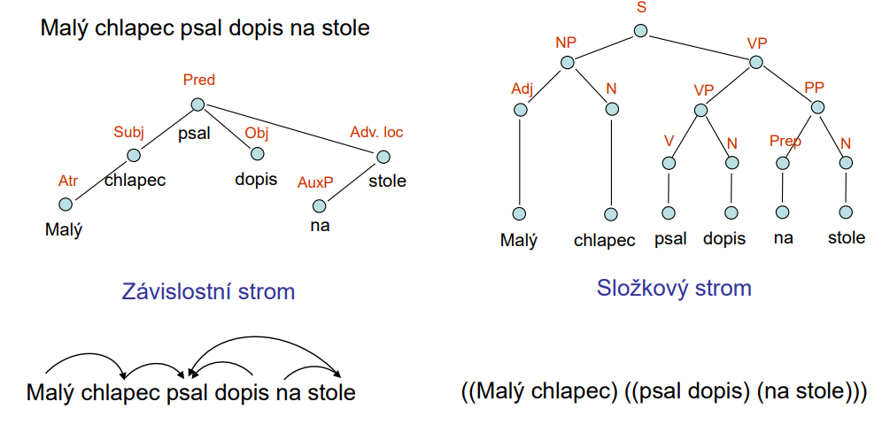
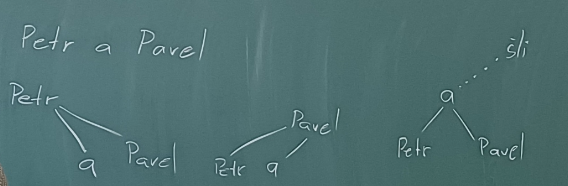
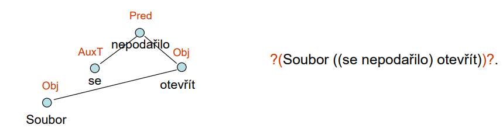
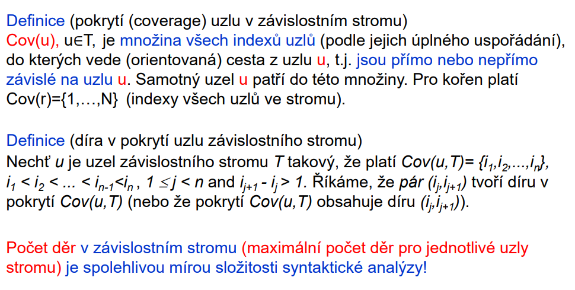
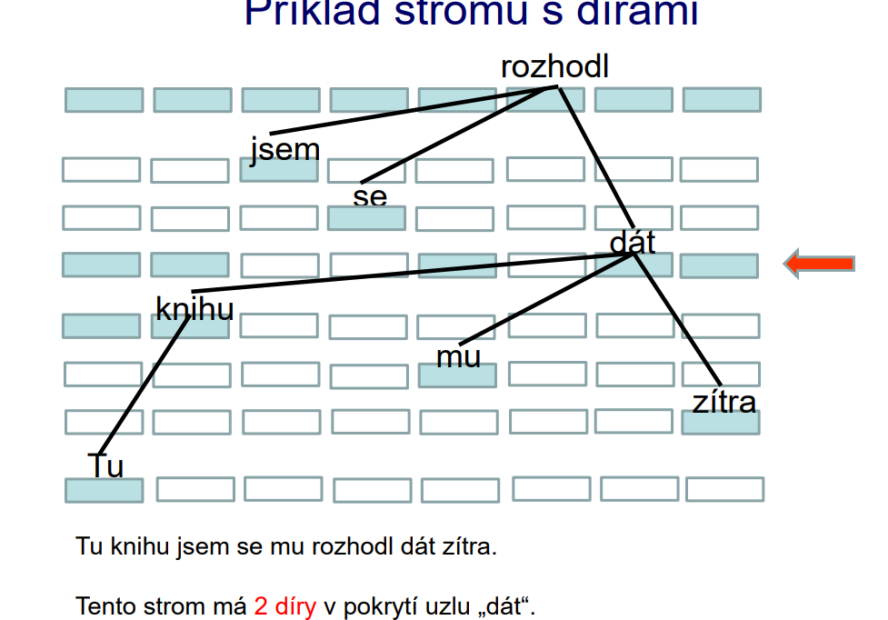

### 5. přednáška 
#### systém mozaika
- výhody
    - není nutné vytvářet slovníky odnborných termínů, pouze množiny relevantních přípon a koncovek, doplněné o negativní slovník (slovník výjimek, který obsahuje slova, která nás nezajímají - vyhovují pravidlům sémantickým pravidlům té koncovky, ale to slovo nepatří do té oblasti, a tak ho vyhodíme vedle, aby se vždycky vymazal)
    - lokální syntaktická analýza umožňuje větší flexibilitu při hledání termínů
- problémy
    - pracné vytváření slovník§ a omzeujícch pravidel v závislosti na tematické oblasti
    - neobsahuje řešení odkazů pomocí zájmen, nevyjádřeného podmětu a podobně
        - 'tento přístroj' je odkaz jiným podstatným jménem a mozaika není schopna dohledat, co se za tímhle myslí (my to pochopíme z kontextu)

#### syntaxe!!! :-)
- po dlouhou dobu to byl nutný krok, abychom mohli dělat cokoliv dalšího 
    - museli jsme vědět, co je podmět/přísudek nebo třeba příslovečné určení 
    - tohle upadlo do zapomnění, když pracujeme s metodami, které používají strojové učení nebo statistiku 

#### dva způsoby reprezentace syntaktické struktury vět
- malý chlapec psal dopis na stole 
- 
- v závislostním stromu se 'na' by pro laiky bylo ve stejném vrcholu jako 'stole', ale pro lingvisty se to rozbije ještě do dalších vrcholů 
    - doplněk se tu nachází zavěšený pod jedním vrcholem, ale v realitě je navázaný jak na podmět, tak přísudek, ale my chceme zachovat stromové rozložení
    - když ten vztah není původní, tak se automaticky vytvoří 
- ve složkovém stromu začneme v kořeni, kde se nachází celá věta a poté se dělí na dvě části - podmětná a přísudková 
    - říká se mu někdy jako frázový ukazatel
    - odpovídá derivačnímu stromu bezkontextového jazyka (formální gramatika z automatů a gramatik)
- počet uzlů ve složkovém stromě bude dvakrát tak velký jako počet uzlů v závislostním
- dá se to přepsat také pomocí závorek a šipeček (viz obrázek), aby to nezabíralo tolik místa
    - existují věty, které nejdou znázornit pomocí jednoduchého zápisu složkového stromu se závorkami, protože nejdou popsat jako bezkontextové gramatiky
        - pro závislostní strom tohle neplatí - je univerzálnější a popíše i věty, které ten složkový ne
            - také je jednodušší na popis (neobsahuje balast nepodstatných věcí)
- u závislostního stromu nejsme gramatiku schopni vygenerovat (není jasné v jakém pořadí se do té věty zapojovaly, protože jsou všechny na stejné úrovni) tak jako pro ten složkový 
- nejde ale říct, který ze stromů je lepší - oba se hodí k něčemu 
    - nejdříve se v minulosti používal složkový strom, ale jak se začaly dělat korpusy se syntaktickým popisem (universal dependencies), tak se vrátil závislostní strom
- 'Petr a Pavel šli do kina' 
    - potřebujeme identifikovat podmět a přísudek, kde podmět tu má být zachována jako jedna jednotka 'Petr a Pavel'
    - v závislostním stromu ale musí být jeden závislý na druhém (i když to tak není, ale potřebujeme tam dostat ty závislosti)
        
        - když bychom narvali do vrcholu spojení spojku 'a', tak se jí musí přiřadit rod, číslo a pád
        - nejde to rozdělit, protože potřebujeme udržet Petra a Pavla jako jednu jednotku (ze 'šli' k nim musí vést jedna hrana)
- když chceme převést závislostní strom na složkový, musíme tam dohodit, které slovo na té úrovni je důležitější (protože to ze závislostního nejde poznat, ale ve složkovém se to nachází)

#### závislostní strom
- znaménka, čárky, všechno má své uzly
- přehledný, ale nedává nám vědět, jak vzniknul a taky ne všechny závislosti jsou přirozené (musíme je tam narvat)

#### složkový strom
- co je složka? jakým způsobem definovat složku?
    - je to skupina slov, která nějakým způsobem spolu funguje (různě velká skupina)
        - dobrý na poznání složek je nahrazovací test (jsme ji schopni nahradit zájmenem (například) a ta věta pořád dává smysl)
        - nebo celou tu složku přesuneme (v češtině jsme schopni vytrhnout jedno slovo ze složky, přesunout ho na začátek věty a ta věta bude pořád fungovat - čeština má volný slovosled)
            - příkladem je věta 'nadešel vánoční čas', kde složka je 'vánoční čas', ale my jsme schopni hodit vánoční na začátek a je to pořád v pohodě 'vánoční nadešel čas'
- odpovídá derivačnímu stromu bezkontextové gramatiky, ale třeba čeština není bezkontextový jazyk 
- méně přehledný, obsahuje nadbytečné uzly

#### neprojektivní konstrukce
- 'soubor se nepodařilo otevřít'
    
- buď se kříží hrany nebo se aspoň kříží s vertikálními projekcemi těch uzlů (jako je to tady)
    - v němčině je to skoro pořád (když házíme sloveso na konec), ale třeba v angličtině to moc nebývá 
- když máme neprojektivní věty, tak je složitější poznat, jestli je syntakticky správně, protože musíme vzít na vědomí právě tu neprojektivitu
- 'tuto knihu jsem se mu rozhodl dát k narozeninám' - v téhle větě se nacházejí dvě neprojektivní konstrukce 
    - maximální počet neprojektivních konstrukce jsou čtyři pro srozumitelnost (teoreticky je počet neprojektivit v české větě neomezen)
    - jedna neprojektivní hrana je 'mu, dát' a druhá je 'knihu, dát'
        - neprojektivní hrana nemusí vést přes celou větu, stačí, když kříží jedno slovo, a to je tady třeba 'rozhodl' pro tu první 
            - pro tu druhou je tam víc slov, které jsou mezi tou dvojicí

- když děláme syntaktickou analýzu, potřebujeme najít všechny neprojektivitu, protože je potřeba je znázornit (normálně se kontrolují jenom dvě jednotky vedle sebe, ale jakmile najdeme neprojektivitu, tak musíme zkontrolovat celou větu)
    - neprojektivita dělá maglajz v syntaktické analýze
- v angličtině je neprojektivní konstrukce max dvakrát (předložka na konci)

- neprojektivní konstrukce existují i v jiných jazycích (holandština, )

#### pokrytí
- definuje v prezentaci
    

- ne každý uzel bude obsahovat díru, takže bereme maximum přes všechny uzly
    
