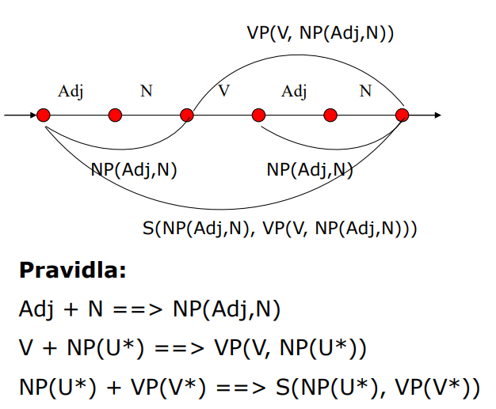
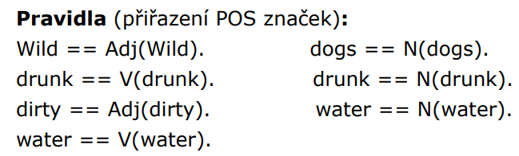

### 6. přednáška
#### nástroje pro syntaktickou analýzu
##### Q-systémy
- bylo to hlavně v 70. letech, ale víc se to nerozšířilo, protože se články o tom psali ve francouzštině a lidi odmítali číst francouzštinu
- používalo se to na automatický překlad mezi angličtinou a francouzštinou pro počasí
- kompletní gramatika se může skládat i z více Q-systémů, které na sebe navazují (výstup jednoho je vstupem jiného)
- popisky hran v grafech reprezentují slova nebo syntaktické (pod)stromy
- stromy jsou linearizovány, což umožňuje snažší manipulaci s nimi a jednodušší zápis pravidel gramatiky
- gramatiku si můžu rozdělit na několik nezávislých částí
    - napíšeme si gramatiku, která bude vyhledávat shodné přívlastky, udělá pro to stromeček, a do další gramatiky už půjde ta věta bez toho přívlastku (přehlednější)
- ten systém je nečitelný (v původní podobě vlastnosti toho systému způsobovaly, že ty složité vstupy byly nepřehledné)
- graf je typicky dvourozměrná struktura, ale my chceme zápis lineární - linearizace 
    - řídící uzel stojí nalevo, všechny podřízené uzly o patro níž tvoří seznam odleva doprava
    - kdybychom chtěli z lineárního zápisu udělat zpětně stromeček, tak pro to nemáme dostatek informací 
        - nepamatujeme si, v jakém pořadí se ty slova v té větě nacházely 
        - potřeba dodat informace navíc, abychom to dokázali zpětně zrekonstruovat
- další problémy:
    - nejsou zde explicitní proměnné (pouze implicitní)
        - ten popis samotný je dost nečitelný
    - logické operátory jsou tu ve francouzštině

##### sestavování q-stromu
- základní datová struktura je graf
    - když je to normální jazyk, tak je to cesta mezi prvním a posledním slovem
    - abychom poznali, co za druh je to první slovo, tak na to potřebujeme morfologickou analýzu
- pak máme základní pravidla, které se uplatňují pro tu danou gramatiku (ta věta samotná je dost jednoduchá, a proto se gramatika bude skládat jenom ze tří pravidel)
    
- z těch pravidel sestavíme lineární verzi popisu této věty a poté přichází čištění stromu, aby nám tam právě zbyla pouze ten potřebný popis

##### příklad analýzy věty
- na začátku jsme přiřadili POS značky, ale jde vidět, že některá slova jsou víceznačná 
    - POS - part of speech
    
- z pravidel gramatiky sestavíme novýg graf
- když máme víc druhů než jenom slovesa, podstatná a přídavná jména, tak se tam musí přidat další pravidla gramatiky 
    - dostáváme se až na stovky pravidel
    - je potřeba se postarat i o okrajové případy
- když máme víc druhů slov, tak máme několik možností stromečků (asi, nejsem si jistá)
- strom bude také vypadat jinak, když si vybereme, že chceme závislostní strom nebo složkový strom
    - můžou nám vzniknout i případy, kdy se ty hrany opakují (je jedno, jestli v závislostním stromu přidám hranu zleva nebo zprava, budou tam dvě stejné hrany)
    - na konci tak můžeme dostat dvě stejné cesty
        - na matfyzu se dodala ještě třetí část čištění, kdy se odstraňovaly ty opakující se části

- v reálném světě jsou ty popisy nepřehledné a blbě se v tom vyzná (fakt fakt blbě, trvá dlouho, než se v tom člověk vyzná)

##### používá se to?
- je fajn umět napsat gramatiku (i když nepůjde o gramatiku pro celou češtinu)
- největší problém pro psaní gramatik je to, že se neustále musím vracet k těm pravidlům, co už existují 
    - když budeme psát jiná pravidla, tak si uvědomím, že tam potřebuju postihnout výjimky

#### transformační gramatika
- co dokázal Chomský? 
    - navazoval na meziválečné směry v lingvistice (ještě ne počítačové)
    - snaha formálně nebo neformálně popsat pravidla jazyků 
        - deskriptivismus
            - objížděli native obyvatele, dostávali od nich povrchová pravidla pro větnou strukturu, a ty poté zapisovala
                - nehledali za tím žádný systém
        - analytická syntax a logický přístup - pokus popsat jazyky pomocí logiky
            - jedna povrchová reprezentace může odpovídat více hloubkovým reprezentacím (významová víceznačnost) nebo naopak (více možností, jak vyjádřit stejný význam)
- 3 základní komponenty
    - báze
    - transformační komponenta
    - fonologická komponenta
    
