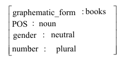
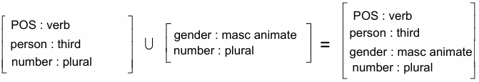
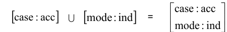
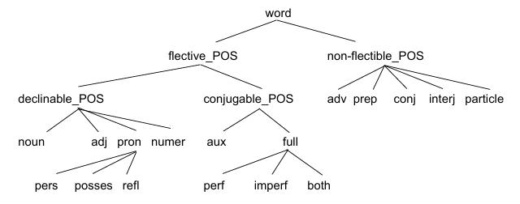

### kategoriální gramatiky
- každému vstupnímu slovnímu tvaru je přiřezan kategorie, která fakticky reprezentuje popis syntaktických vlastností dané slovní formy
- kategorie se zapisují ve tvaru a/b nebo a\b, kde lomítko určuje pozici b (zda je vpravo / nebo vlevo \ od a)
- existují základní dvě pravidla 
    - X/Y Y $\to$ X
    - Y Y\X $\to$ X
    - popisují doplnění chybějících prvků do kategorie X
- vše podstatné v kategoriálních gramatikách musí být obsaženo ve slovníku (vzhledem k variantám slovosledu je potřeba uplatnit kombinatorická pravidla)
- dobré pro krátké věty, ale horší popis pro delší 
- extrémní důraz na slovník

### unifikační gramatiky
- základní datový typ (feature structure; sestava rysů)
    - sady atributů a jejich hodnoty
    
- tyhle struktury se přiřadí každému slovu na vstupu a exisutje základní operace - unifikace 
    - tato operace je dovolená pouze tehdy, pokud hodnoty všech rysů z určité sestavy neodporují hodnotám stejného rysu z jiné soustsavy
        - pokud dvě soustavy rysů obsahují rozporné informace, tak je výsledkem vnitřně rozporná sestava rysů 
        
- výhody:
    - umožńuje to, že kde ta unifikace není v rozporu, tak běží dál 
        - když nevíme, jaký je rod té struktury, tak se to dozvíme později (unifikuje se to se slovem, co tam má určený rod)
            - pro věci, pro které nemáme dostatek informací, nemusíme řešit hned

#### sestavy rysů 
- základní datvoá struktura unifikačnách gramatik 
- když je proměnná u nějaké struktury, tak pokud změna proběhne u jedné hodnoty s proměnnoou, tak musí proběhnout i u ostatních 
- problém: mechanismus nijak nebrání tomu tvořit nesmysly (spojujeme hodnoty, které spolu nemají nic společného)
    
    - tohle se vyřešilo tím, že se zavedly typy sestav rysů 
        - bylo nadefinováno, co za hodnoty může patřit do daného typu 
        

#### výhody a nevýhody
- výhody:
    - jednoduchý univerzální mechanosmus, kde se používají jednoduché a intuitivní pojmy a indetifikátory
    - víc na slidu

### funkční generativní popis
- pokus popsat tvorbu vět v několika různých úrovních (fonetická, fonologická, morfématická, povrchová a tektogramatická)
    - fonetická je nejnižší rovina a TG je nejvyšší
    - morfologická informace (podstatné jméno je v prvním pádě) se často přenese do fonologické úrovně (podstatné jméno v prvním pádě bude nejspíše podmět)
- klíčový prvkem je teorie valence 
    - teorie, která systematickým způsobem popisuje vztahy 

#### valence 
- je to mezinárodní term
- valence popisuje nejužší vazby ve větě (nejčastěji se to týká slovesa)
- týká se to tektogramatické úrovni 
- obligatorní x fakultativní 
    - obligatorní aktant - nesmí v té větě chybě (nemusí být řečen, ale vyplyne z kontextu)
    - 'moji přátele přijeli' 'kam?', tak na to nemůžu říct nevím, protože z kontextu plyne, že to vím - obligatorní
        - pokud nelze opodvědět 'nevím', jedná se o obligatorní aktant
        - ale na otázku 'odkud?' odpověď vědět nemusím - fakultativní
- rozeznáváme pět základnách aktantů (závislých členů)
    - mluvíme hlavně o sémantické úrovni
    - konatel, paciens, adresát, origo, efekt 
        - s tímhle se pracuje tady, ale třeba v brně mají jiný popis
        - hrubší klasifikace, ale zase to lépe rozděluje (místo padesáti skupin máme jenom pět)
        - každý z nich ve větě může být zastoupen pouze jednou
- potom jsou ještě volná doplnění - mohou se vyskytovat vícekrát 
- valenční rámec - seznam aktantů (i fakultativních) a obligatorních volných doplnění
    - jediné, co tam není, je fakultativní volné doplnění 
        - valenční slovník češtiny - slovník (lopatková a žabík)

### kontrola gramatické správnosti
- aplikace syntaxe 
    - ne kontrola překlepů
- nevystačíme jenom s jednoduchými informacemi 
    - bere se mimo jiné i kontext ('sportovci věnovaly plyšáka' - v kontextu, že dívky sportovci házely plyšáka, tak je to v pohodě, ale pokud sportovci někomu házeli plyšáka, tak je to správně)
    - když si program není jistý, že je to chyba, neflagne to
- problémy specifické pro češtinu
    - gramatická shoda
    - interpunkce
        - funguje jedno pravidlo: když je v souvětí dvě určitá slovesa, tak mezi nimi musí něco být (spojka nebo čárka)
            - zastavte se prosím u nás (tady to je výjimka)
    - neprojektivní konstrukce
        - která děvčata chtěla ovoce
    - zájmena (mně/mě)
- jak kontrolovat? 
    - chybové vzorky    
        - vhodnější pro jazyky s pevným slovosledem (třeba angličtina - podmět je na začátku věty)
        - velmi omezený kontext - vzorky jsou dost krátké
        - vlastně je to lepší než gramatika, protože tady to reálně je použitelné 
    - gramatika 
        - nikdy nebude úplná (nebudu kontrolovat správnost vůči jazyku, ale vůči naší gramatice)
        - nijak výrazně nepomůže 