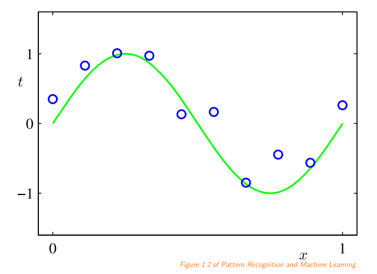
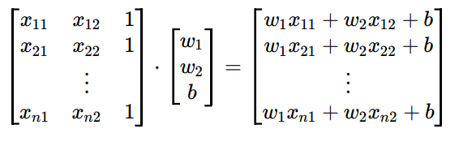
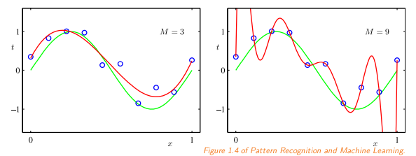

#### 1. přednáška 
##### otázky
**DODAT**

##### co je strojové učení 
- počítač se učí z experience E **DODAT**
    - task T 
        - clasifikace - o nějakém vstupu řekneme, že patří do nějaké z *k* kategorií
        - regrese - ze vstupu odhadnout nějakou hodnotu 
        - rozbor nějaké věty, což bude graf 
        - nahrávka se šumem a chceme se zbavit toho šumu 
    - metrika M
        - accuracy - poměr případů klasifikovaných správně (průměrná odchylka, errory)
    - experience E 
        - *esotericky znějící zkušenost E*
        - jsou to prostě data, která pochází z minulosti a chceme je uplatňovat v budoucnosti 
        - podle toho, jaká ta data jsou, mluvíme o dvou skupinkách
            - supervised (s učitelem) - ukázky vstupů a očekávaných výstupů 
            - unsupervised (bez učitele) - máme data, ale ne výstupy
                - hledáme strukturu - patří do nějakých skupin
                - nějaká reprezentace dat (reprezentovat obrázky jako vektory a zkoumat jejich podobnost)
            - zpětnovazebné učení (reinforcement learning) - není tu žádný cíl (tady na tomhle obrázku je pes, a to je správně)
                - máme ohodnocující funkci, která ale neřekne, co je absolutně dobře a špatně 
                    - model, co hraje nějakou hru
                    - úspěch na burze
                - řízené strojové učení - vezmeme hru go a budeme zkoumat, co by udělali velmistři v nějaké partii
                    - nestaneme se lepší než velmistr, ale u zpětnovazebného můžeme algoritmy postavit proti sobě, a tak se budou učit
<d>
</d>

- sociální nebo technologickou praxi (je to něco, co dělají lidé)
    - chceme něco naprogramovat 
        - musíme ten problém formalizovat, hledáme algoritmy pro ty koncepty (programujeme eshop - zboží je na skladě, máme zákazníky, co má adresu a historii, a objednávka obsahuje něco -> vše se to dá popsat pomocí konceptů)
    - strojové učení se používá, když nechceme/nemůžeme takovou koncepci vytvořit
        - máme ale data a metriku na úspěšnost, a tu používáme
        - machine translation se nejdřív zkoušel ručně pomocí gramatik, ale to nevyšlo, a pak se na to zkusilo strojové učení
            - máme data a nějakou metriku (nejednoduše vymyšlená)

#### historie machine learning 
- perceptron 
    - první převratný algoritmus 
    - lineární model, který má pro různé vstupy váhy, a pak řekne pravda/nepravda
- *xor problém*
    - lineární modely nejsou schopni vyřešit tenhle problém 
    - elektronická součátka, která je pro tohle, je stěžejní pro budování počítač
    - a když to nedokáže machine learning, tak je to k ničemu
- pak přišly rozhodovací stromy (tohle je v druhé půlce semestru)
    - statitické přístupy 
    - random lesy 
    - gradient-boosted decision trees
        - když nepoužijeme neuronové sítě, použijeme tohle 
- neuronové sítě   
    - netrpí problémem, že nezvládne xor
- prakticky, když se sítě udělají pořádně, tak jsou super, tak proto se tomu věnuje machine learning 
- pod povrchem je ještě třetí směr - bayesovská statistika 
    - naive bayes 
        - je to z poloviny 18. století, kde se počítají pravděpodobnosti
        - pravděpodobností něco grafy 
            - teď už moc ne používáme
            - super, když máme málo dat a jsme si o nich nejistí 

#### basic methodology a notation 
- máme vstup a náš vstup se vždycky bude jmenovat x, který bude vektorem o velikosti D 
- regrese 
    - chceme předpovědět pro to číslo t z reálných čísel pro x
- klasifikace
    - máme set k labelů a chceme vybrat korespondující label pro input x
    - můžeme vybrat jednu třídu nebo pravděpodobnostní rozložení pro všechny třídy 
- training set
    - **DODAT**
- optimalizace 
    - je to match the training set as well as possible 
    - předpokládáme, že data z minulosti mají stejný typ jako data z budoucnosti 
        - necháme si část dat na straně na testování, na nichž budeme měřit, jak ten model funguje 
    - data, na kterých se bude učit, takto bude z jednoho časového období
    - a testovací data by měla být z pozdějšího období
<d>
</d>

- všechny vektory budou sloupcové vektory, dokud nebudou transponované 
- skalární součin se značí $a^{T}b$
    - je to totiž násobení matic

##### example data set 
- dostaneme několik bodů a chceme zreplikovat tu křivku
- nevíme, že to je sin(x)

- data jsou v $X \in \R^{NxD}$
    - kolekce N instancí, každá je dlouhá D reálných čísel

##### lineární regrese
- náš první model! pro lineární regresi
- máme body $x$ a chceme předpovědět cílovou hodnotu
    - každý dostane vlastní váhu, kterou ty body přenásobíme
    - **vzorec na slideu 22**
- vynásobíme a sečtu ta čísla a přidám k tomu nějaký bias 
- lineární algebraický algoritmy jsou lepší než for cykly 
    - *kdykoliv jde něco napsat jako operace s maticemi, je to o dost efektivnější než napsat for cyklus* 
- máme tam ten bias b 
    - představíme si, že každé dato je o jedna delší, kde na posledním indexu bude jedna 
    
<d>
</d>

- máme dataset N vstupů a N výstupů a chceme najít weight values - chceme mimimalizovat error funkci mezi real target a jejich predikcemi
- mean squared error
    - ale můžeme se zbavit toho mean a prostě to budeme místo $1/N$ to budeme násobit $1/2$
- chceme zminimalizovat funkci, a to uděláme pomocí deriavce (to je prostě to, co jsme dělali na analýze 1/2)
- lineární regrese je konvexní problém (není čas to dokazovat), takže minimum je jenom jedno 
- spočítejme si tu derivaci! **NAHRÁVKA**
    - v teorii ta matice nemusí mít inverzi, ale v realitě jí bude mít vždycky (jde tam přičíst nějaký šum a bude konvergovat)

##### polynomial features 
- není ta zajimavý, protože málokrát se dělá regrese tohoto typu 
- my si můžeme ta data rozšířit tím, že si z těch dat něco spočítáme 
- když bychom měli jenom číslo a ten bias, tak bychom grafem mohli tak max prokládat přímky, což je k ničemu, když ta křivka má tvar sinus
- rozšíříme si features o jejich mocniny 
    - v realitě to dělá neuronová síť 
    - můžeme modelovat ty zajímavé křivky (to smrtí taylorem)
    - nesmíme to přehnat, protože pak je ten model moc silný a dokáže ty data namodelovat naprosto přesně (kdy projde všemi body), ale model negeneralizuje
        - nepovedlo se nám uhádnout tvar té křivky
        
- jde vidět, že ta chyba roste při mocninách
- underfitting - tak málo dat, že se z nich nedá nic moc udělat
- overfitting - funguje to na ty učící, ale nechytá to ty testovací 
