### 2. přednáška
#### lineární regrese - opakování
- *b* se schovává do *w*
    - chceme nadrovina, která je nejblíže té funkci a hledáme jí pomocí minimalizace té funkce
        - což je pomocí parciálních derivací 
- data si můžeme rozšířit pomocí jejich mocnin 
    - když použijeme moc vysoký polynom, tak je to super na našich datech, ale je to hrozné na testovacích

#### regularizace
- *kapacita modelu*
    - máme reprezentační (množina všech funkcí, které ten model dokáže popsat)
        - když použijeme polynom druhého stupně, tak popíšeme víc funkcí, než když je to jenom to jedno číslo 
            - sice je to nekonečno tak jako tak, ale lineární funkce je podmnožinou kvadratické
    - a efektivní (jaký funkce jsou pravděpodobně dosažitelné trénováním)
- chceme zachovat reprezentační kapacitu, ale ve skutečnosti ho chceme omezit na ty funkce, které považujeme za rozumné
- typický průběh:
    - malá kapacita modelu - velká chyba u trénování a učení 
    - zvyšujeme kapacitu a dostaneme se do bodu, kdy začíná zase růst chyba pro testovací data, ale pro učící pořád klesá
    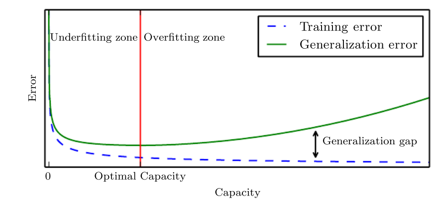
- pro řešení té chyby je nejlepší sehnat víc trénovacích dat, což ale často není možné 
- jinak, budeme snižovat efektivní kapacitu modelu, tak aby učení preferovalo funkce, které považujeme za rozumné

#### l2-regularizace
- chceme z trénování dostat nižší váhy
- k chybě dodáme polovinu vah na druhou
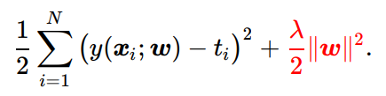
- zelená funkce je jednodušší než ta červená funkce
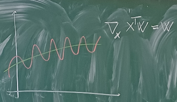
    - změna funkce je její derivace a my bychom chtěli upřednostit funkce, které mají nižší derivaci 
    - když se podíváme, jak se podle x mění výstup našeho modelu
- když snižujeme váhy, tak snižujeme naši derivaci a stává se tak jednodušší 
- to, s jakou váhou chceme se naučit na učících datech a jak moc jednoduchou funkci chceme se určí podle té $\lambda$ ve vzorci
    - je lepší, když je ta funkce jednodušší 
- v praxi je jedno, jestli tam hodíme bias nebo ne, ale v domácím úkolu je **potřeba vyjmout to béčko z regularizace**

- s lambdou můžeme hýbat dost podobně jako se vstupními polynomy minulý týden
- když vybereme dobré číslo, tak dostaneme dobrou křivku, ale když vybereme moc jednoduché číslo, tak dostaneme moc jednoduchou křivku, což je underfitování 
- graf, jak se chovají data podle toho, jaká je hodnota $ln(\lambda)$
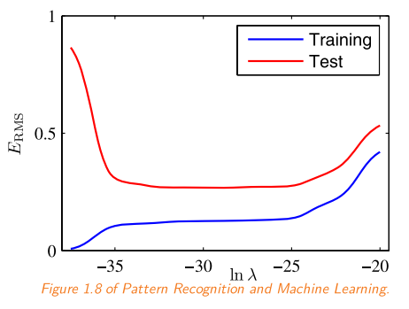

#### regularizace lineární regrese
- přičteme k tomu vzorci jednotkovou matici přenásobenou $\lambda$
    - když tam chceme vynechat ten bias, tak to nebude úplně jednotková matice, protože tam budeme muset vynechat tu část pro bias v jednotkové matici
- když je $\lambda$ kladné, tak ta matice bude pozitivně definitní a bude mít vždycky inverz
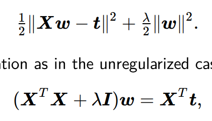

#### hyperparametry
- rozhodujeme zatím dvě čísla - stupeň polynomu a tu $\lambda$
- chceme optimalizovat pro data, co jsme viděli, a když vybereme dobré čísla, která dávají co nejmenší chybu, tak si ale nejsme jistí, jestli to bude dobré i pro testovací data
- rozdělíme si data ještě jednou - přidáme ještě validační data, abychom správně nastavili hodnoty těch hyperparametrů
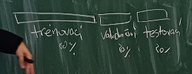
- dříve se jela ta procenta, ale jak roste počet dat, tak se ty procenta mění (ta procenta klesají)
- u malých problémů se dá dělat grit-search, kdy chytře vyzkoušíme co nejvíc hodnot, a které vyjdou nejlépe, tak ty použiju 
    - v realitě se hledá na internetech a na blogískách, co fungovalo ostatním

#### what went wrong? 
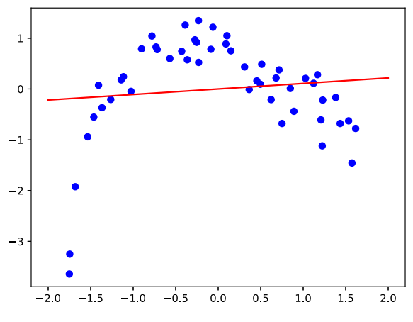
- nízká hodnota polynomu, underfitujeme

- tady zase overfitujeme
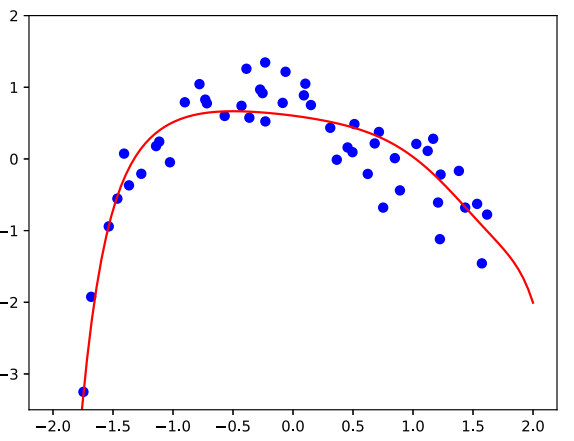
- tohle je v pohodě, k předchozímu jsme přidali tu regularizaci
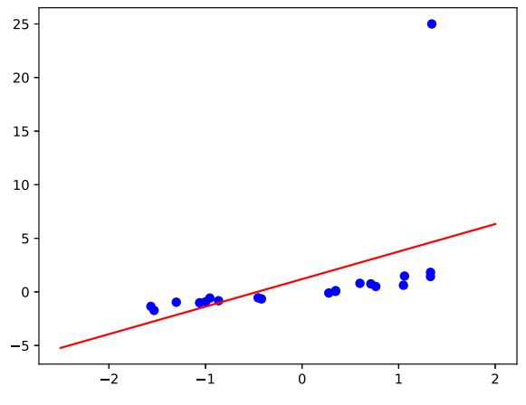
- tady je ten bod úplně mimo, který tahá křivku někam doprčic 
    - když jsme schopni poznat ten bod, tak ho odstraníme
    - jinak upravíme parametr - přidáme l2 regularizaci a zvětšíme $\lambda$
    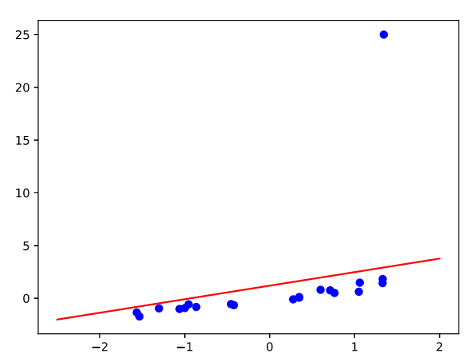

#### náhodná proměnná 
- výsledek random procesu, která může být buď diskrétní nebo spojitá
- pravděpodobnostní rozdělení musí splňovat nějaké axiomy
    - pro diskrétní: dohromady musí jít do jedničky a žádná hodnota nesmí být záporná
    - pro spojitou: od mínus nekonečna do plus nekonečna měla integrál roven jedné (jeden bod má pravděpodobnost nula, musíme se ptát na nějaký rozsah intervalu)

#### otázky od studentů 
- jakých hodnot lambda nabývá? 
    - v neuronkách to bývá fakt malá hodnota 
    - když je tam hodně featur s podobnou hodnotou, tak ta hodnota může být dost vysoká 
- má smysl použít jiný než 2. moment v lin. regresi? 
    - někdy se používá i L1 regularizace, která má spoustu nulových hodnot 
        - lambda není jedno číslo, ale vektor (předpokládám)
- co dělá l2 regularizace?
    - snižuje váhy, tak abychom dostali jednodušší funkci, aby se předešlo overfitování 

#### stochastický gradient descent
- funkce $L$ je to, co optimalizujeme (jako loss) a obsahuje to všechny regularizace a všechny ty ostatní věci (třeba chyba)
- modely se dají určit jinak než skrz analytické řešení v datech
- je to praktičtější, protože se nikdy ta matice nemusí používat celá
- podívám se na funkci a kam směřuje derivace té funkce a postupně skákám mezi kroky derivace - aproximuju tu funkci po částech 
    - v tom bodu předpokládám, že je funkce lineární
    - velikost kroku se značí $\alpha$
    - místo toho, abychom našli minimum analyticky, tak jdeme postupně algoritmem a hledáme ho 
    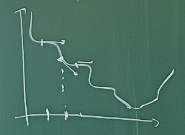
- chybová funkce je střední hodnota přes tu funkci 
- stochastic gradient descent
    - vezmu jedno dato, najdu chybu a spočítám z toho gradient 
    - je to noisy a dlouho to konverguje, ale funguje to 
    - když si budu náhodně vybírat z distribuce nám dává unbiased odhad té střední hodnoty 
        - když tohle budeme dělat dostatečně dlouho, tak je to jako spočítat střední hodnotu 
    
#### gradient descent convergence
- když je ta chybová funkce spojitá (+ ještě něco), tak skončíme aspoň v lokálním optimu té funkce
    - ty další podmínky jsou
        - jsme ochotni udělat nekonečno kroků (mohlo by se stát, že by to skákalo pořád z jednoho místa na druhé do nekonečna)
        - zároveň po těch krocích chceme, aby se snižovaly (pro nás ten learning rate bude konstatní)
- lineární regrese má convexní ztrátovou funkci - má jenom jedno minimum 

#### řešení lineární regrese using SGD
- když trénuju ten model, začnu s váhami nastavenými na nulu - dají se nastavit náhodně 
- pokračuju, dokud model nezkonverguje anebo nezačne růst validační chyba 
- udělám krok velikosti $\alpha$ vynásobeným gradientem a ty váhy upravím 
- batche samplujeme náhodně z trénovacích dat
    - v realitě si data náhodně seřadím a potom je rozkrájím na batche a poté měřím, jak dlouho mi trvalo projít ta trénovací data

#### what went wrong 
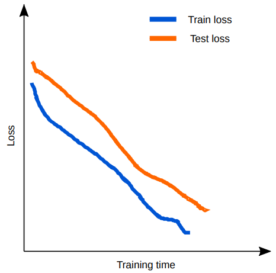
- tohle ještě neskončilo, protože to ještě nezkonvergovalo 
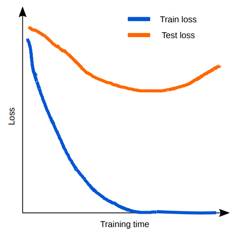
- nastal overfiting 
- pro tohle existuje trik, kdy koukáme na chybu na validačních datech, tak ve chvíli, kdy začala růst, tak už to nemá smysl dál trénovat, protože bychom začali jenom overfitovat 

#### features
- doteď jsme měli na vstupu číslo z osy x
- ale data mají různé vlastnosti a my s nimi můžeme zacházet různě 
- když je na vstupu číslo, tak ho rozšíříme o mocniny
    - když je dost čísel, tak se ty mocniny dají kombinovat
- máme diskrétní vstup (třeba dny v týdnu), dají se sice převést na čísla, ale (ale čtvrtek není čtyřikrát pondělí)
    - uděláme to tak, že budeme mít sedmiprvkový vektor, kde bude jedna jenom tam, který den dnes je 
- vypořádat se s tím, že ty rysy mohou být řádově jinak velký 
    - každá váha odpovídá jednomu z těch rysů a jedno bude v tisících a jedno v jednotkách, tak potřebujeme jiný learning rate pro různé váhy
    - ty rysy se normalizují 
    - od všech odečteme minimum a vydělíme to rozdílem mezi maximem a minimem (tohle jde, pokud je to v nějakém rozsahu)
    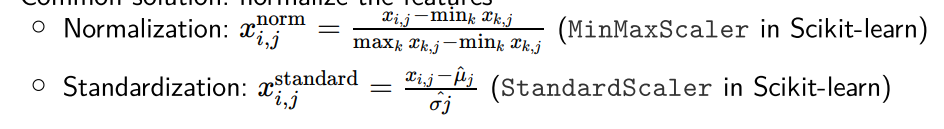
- když by tam bylo pár hodnot navíc, co jsou dost daleko, tak se dá provést standardizace, kde odečteme průměr a vydělíme ho rozptylem (většina hodnot bude v intervalu -1 a 1)
    - když existují fíčury, co se řádově liší, tak se zlogaritmují 