## 3. přednáška 
### testík na začátku
- nepravdivé tvrzení o L2- regularizaci - čím vyšší je lambda, tím nížší je chyba
    - čím víc zvedáme číslo lambda, tím víc nutíme ty váhy být nula, a tak se nic nenaučíme
    - když se lambda bude blížit nule, tak se to blíží dobrému výsledku na trénovacích datech, a to většinou znamená overfitování 
- exact solution and sgd solution of linear regression - s sgd můžeme vybrat dobrý výsledek, když zastavíme to trénování v tom dobrém bodě 
    - bude dobré řešení na těch validačních datech
    - chyby: sgd může najít to nejlepší řešení, ale musí platit dané podmínky
        - to je za podmínek, že jsme ochotni udělat nekonečno kroků, ale ta chyba se bude snižovat
- learning curves - průběh testovací a validačních křivek
    - pro pozorování, jak se to učí
    - používají se na to validační data
### perceptron
#### binary classification 
- klasifikace do dvou částí
    - nejjednodučejí to jd epomocí accuracy, což je ratio of input examples that were classsified correctly (jejich predited class se shoduje s target class)
- vezmeme lineární regresi a poté rozdělíme ty výsledky na pozitivní a negativní podle toho, jestli jsou větší/menší než ten treshold  
    - často se jako treshold používá nula 
        - symetrie a biases samotné fungují jako trainable treshold

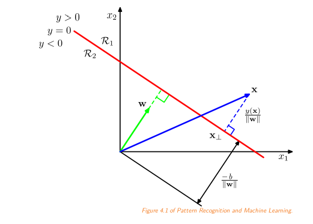 
- while $\exists i: t_{i}x^{T}_{i}w \lt 0:$
    - if $t_{i}x'^{T}_{i}w \gt 0:$
        - $w += t_{i}x_{i}w$

#### perceptron algoritmus 
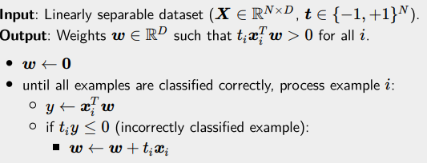

- když je tam ta divná suma ve značce, nebude to ve zkoušce 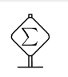    
    - nástin toho, proč ten divný algoritmus funguje 
- problémy algoritmu:
    - body musí být lineárně separabilní, jinak to běží nekonečně dlouho
    - o té nadrovině nic nevíme, jenom víme, že ta nadrovina existuje 
        - najdeme prostě nějakou náhodnou a dál už nemůžeme hledat
        - nemůžeme od ní chtít, aby byla nějak daleko od nich a splňovala další vlastnosti
    - dělá jenom predikce, neřekne nám ty pravděpodobnosti těch predikcí

### basics of probability
#### common probability distributions 
- bernoulliho rozdělení 
    
    - modeluje binární pravděpodobnost 
    - máme dva možné výstupy 
        - jeden nastane s pravděpodobností $\varphi$ a ten druhý má $1-\varphi$
- kategorické rozdělení 
    - extense bernoulliho rozdělení, kde máme více diskrétních výstupů než dva a dohromady se to vyčte na jedničku (zapisují se do vektoru)
    - výstupem této náhodné proměnné je zase vektor one-hot vektor
        - vektor, který má všude nuly, krom jednoho indexu, kde ta možnost zrovna nastala
    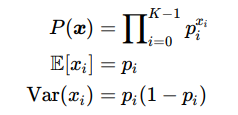
- normální rozdělení 
    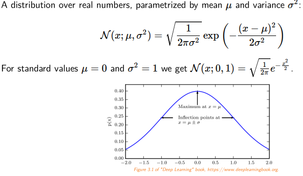
    - dá se vyvodit z principu maximální entropie (další reprezentace okhamovy břitvy)
        - přidává co nejméně zbytečných předpokladů
        - chceme distribuci, co má za těch podmínek co největší entropii 
            - spojité rozdělení se střední hodnotou a rozptylem a nic dalšího
            - a tohle je právě normální rozdělení 

#### information theory
- začneme tím, kolik informace dostaneme, když pozorujeme nějakou náhodnou proměnnou z nějakého rozdělení 
- je to funkce nějaké pravděpodobnosti 
    - když se nějaký stav má stát s pravděpodobností jedna a on se fakt stane, tak z toho dostaneme nula informací, protože to není nic zajímavého 
    - když mám dva na sobě nezávislé, tak z toho dostanu dvě informace 
    - $P(x,y)=P(x)*P(y)\implies I(x,y)=I(x) + I(y)$
        - je jedno, jestli nejdříve zkontrolujeme první nebo druhý jev, protože jsou na sobě nezávislé 
    - čím méně je ten jev očekávaný, tím víc jsme překvapeni 
        - $P(x)=0 \implies I(x)=\infty$
- ta funkce je tedy tvaru: $-logP(x)$ 

#### entropie
- jak moc jsme překvapeni v celé té distribuci 
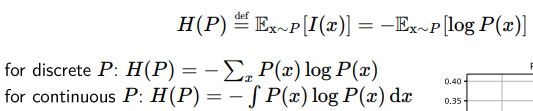
- zatím jsme přemýšleli o diskrétních rozděleních, ale dá se přepsat i na spojité a dostaneme integrál
- pro účely entropie si dodefinujeme, že limitně k nule se $x*log x = 0$ a to samé pro $P(x)=0 \implies P(x)logP(x)=0$
- pro binární logartimy se entropie měří v bitech 
- příklad, kde máme čtyři stavy *A, B, C, D*
    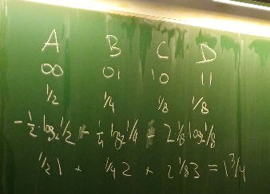
    - 1 a 3/4 je ta hodnota entropie
    - když ale známe ty pravděpodobnosti, tak se to dá efektivně zakódovat
        - A = 0
        - B = 10
        - C = 110
        - D = 111
    - v tomhle případě máme dva bity na jeden znak, protože jsme předpokládali, že je to uniformní rozdělení, ale nakonec jsme zjistili, že to není uniformní rozdělení 

#### cross-entropie
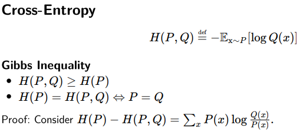
- ať už si představujeme libovolné pravděpodobnostní rozdělení, tak z toho nikdy nebudeme mít méně informace, než bychom získaly, kdybychom vybrali to správné rozdělení 
- důkaz, poznámky:
    - rozdíl logaritmů je podíl logaritmů 
    - zasubstituujeme log(x) za x-1, protože to prostě rychleji 
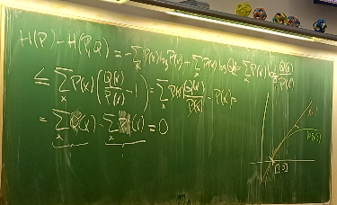
- když se ta entropie a cross-entropie se rovnají 

#### kullback-libelerova divergence
- rozdíl mezi cross-entropií a entropií
- o kolik víc jsem překvapený, když si myslím Q, než když bych si správně myslel P
- vždy je to kladné 
- neplatí trojúhelníková nerovnost 
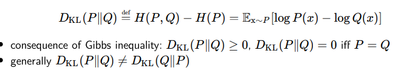

### maximum likelihood estimation 
- máme trénovací data vytáhnutá nezávisle z data-generating distribuce 
- likelihood - s jakou pravděpodobností nám ten model dává ta data (?? asi)
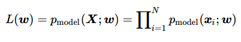
- trénování se dá brát tak, že hledáme co největší likelihood na těch trénovacích datech 
- hledání maximum likelihood estimation of w se dá spočítat, poznámky:
    - hodíme tam logaritmus, nic se nestane a zbavíme se produktu a dostanem tam sumu 
    - když tam hodíme mínus, tak jsme tu funkci vzali a otočili a místo maxima hledáme minimum (negative log likelihood)
    - pak jsme tam hodili 1/N
    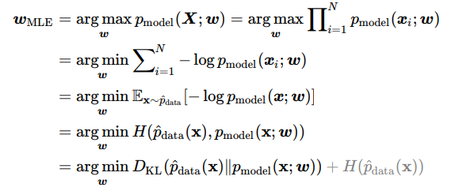

### logistická regrese
