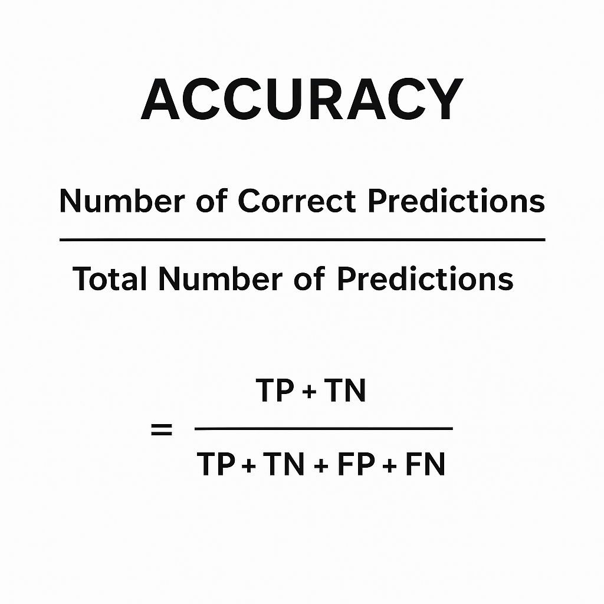
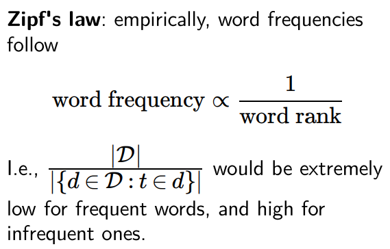
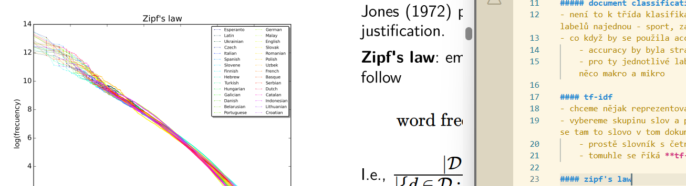
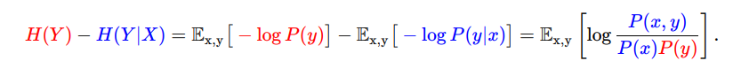
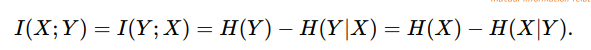
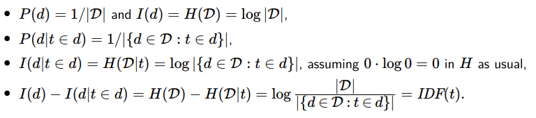
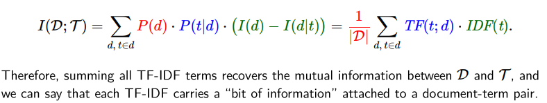
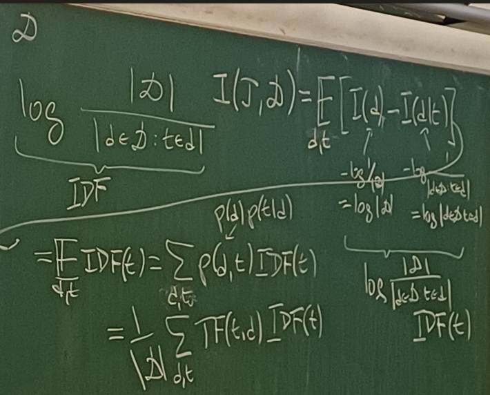
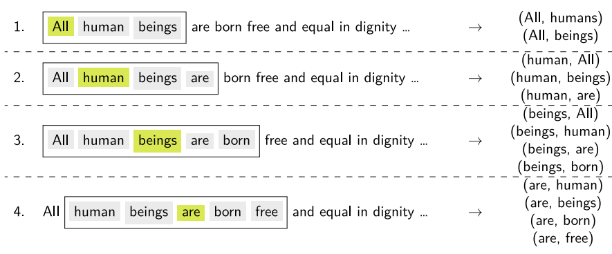
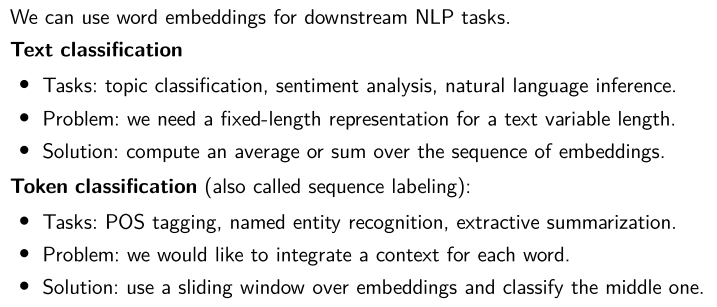

### 6. přednáška 
#### metrics for exemplary NLP tasks
- máme vstup a chceme ke slovům přiřazovat jejich třídy (podstatná jména a podobně)
- každé slovo má jednu třídu a pro určení se 

- chceme označit všechna osobní podstatná jména a co k tomu použijeme za metriku?
    - accuracy ne - chceme co nejmenší chybu a jelikož většina je obecné podstatné jméno, tak tam bude rvát co nejvíc nul 
    
    - použije se precision, f-score a ještě něco

##### document classification
- není to k třída klasifikace ale k label (ten soubor může obsahovat více labelů najednou - sport, zahraničí a podobně)
- co když by se použila accuracy? 
    - accuracy by byla strašně nízká 
    - pro ty jednotlivé labely vytáhneme precission a f-skóre a uděláme něco makro a mikro

#### tf-idf
- chceme nějak reprezentovat celý dokument
- vybereme skupinu slov a pro nich si budeme pamatovat, s jakou četností se tam to slovo v tom dokumentu vyskytne 
    - prostě slovník s četnostmi
    - tomuhle se říká **tf-term frequency**

#### zipf's law
- frekvence slov je nepřímo úměrná v četnosti daného jazyka
    
- využívá se to v metodě **idf - inverse document frequency**
- chceme zjistit, v kolika dokumentech se to slovo nachází a v čím méně dokumentech to je, tím větší hodnotu dostane 
    - některá slova jsou tak častá, že je nepotřebujeme
        - existují stop slova, pro něž se to idf ani nepočítá, protože jsou tak častá (jako funkční zájmena)
    - zároveň tam jsou slova, která jsou tak málo častá, že už je poté nemusíme nikdy vidět (ty taky vyhodíme)
- aby to bylo normalizované, zlogaritmujeme to 
    

#### mutual information - teorie informací
- máme dvě hodnoty $x$, $y$ s distribucí $x \sim X$ a $y \sim Y$
- uděláme podmíněnou entropii $H(X|Y)$ a pomůže nám to vyřešit otázku *how many bits do we learn about Y when we find out X?*
    
- a z toho dopočítáme $H(Y)- H(Y|X)$, tedy tu otázku
    
- byl ten konečný vzoreček již někde viděn? ano! jako kublerova něco (druhá/třetí přednáška)
- mutual informatin je nula $\iff$ ty dvě informace jsou na sobě nezávislé 
- vlastnosti této funkce?
    - symetrické
    

##### TD-IFD as mutual information 
- máme dokument a nic o něm nevíme, tak to uděláme uniformly náhodně, z čehož plyne 
- $P(d)$ je self-information a je to jiný popis entropie - kolik informace dostaneme, když pozorujeme nějaký jev (překvapení z toho dokumentu)
    
- nakonec zjistíme, že je to střední hodnota IDF, a to se snažím se spočítat - dosadím tam sumu 
    - 
- ale víc se mi líbi, jak to rozepsal na tabuli
    

#### Word2Vec
- když se model naučí reprezentovat ten model tak, aby dokázal dělat tisíc tříd, tak se dá použít i na jiné problémy, kde není potřeba ho tolik trénovat
    - třídy, v nichž jsou barvy, v nichž jsou čáry v nějakém směru, apod. 

##### word embedding
- reprezentujeme slova one hot vektorama  
- vektorům, které obsahují tahle slova, se říká právě word embedding
- 2003, to bylo použito pro predikování pravděpodobnosti následujícího slova 
- 2011, ukázalo se, že ty one hot vektory mají hezké vlasnosti 
    - jsou u sebe slova, co mají podobný význam (u Francie se nacházela slova jako Belgie nebo Rakousko)
    - vhodné ale jenom pro malé slovníky a výpočetně náročné 

##### Word2Vec
- vedlo to k tvobě skip-gramu 
    - snažíme se uhádnout, která slova se budou nacházet v okolí jednoho slova (kolem něj)
    - úloha sama o sobě nemá smysl, ale jsme díky tomu schopni hezky reprezentovat data
    - máme text a jedeme okénkem, které nám říká, co se okolo vybraného slova nachází za slova
    
- jak to probíhá? 
    - nevím, nepochopeno

##### negative sampling
- nevidí to žádné negativní případy, jenom pozitivní, takže by pro každou dvojici vyhodil po nějaké době 'jo', protože by chybné třídy nijak netlačil dolů, jen správné dvojice nahoru
- stačí jenom málo negativních samplů a ten model se to jednodušše naučí

##### using word embeddings
- chytřejší vážený průměr vektorů - využijeme TF-IDF váhy a v tom součtu tam prosadit slova, které nesou větší informaci   
    